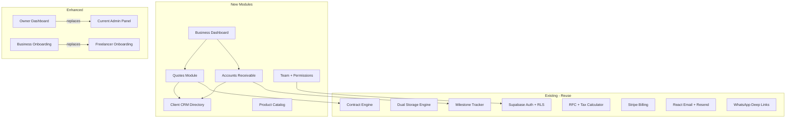

# PRD: Business Helper — The B2B Pivot

<!-- STATUS-AUTHORITY: docs/STATUS.md -->

> [!NOTE]
> **Live status lives in [`docs/STATUS.md`](../STATUS.md) — not here.** Phase tables and priority markers here are the **product plan**. Nothing in this file is evidence that a feature works.

> **Co-Founder Analysis & Product Strategy Document**
> 
> Pivoting from Mi Pacto (freelancer contract management) to a **lightweight, all-in-one business operations platform** for small/medium businesses in Mexico that can't afford or staff an Odoo/SAP/Dynamics deployment.

---

## TL;DR

We are pivoting from a single-purpose freelance contract tool (Mi Pacto — 696 visitors, 0 signups) to **"Business Helper"** — an all-in-one business operations platform purpose-built for Mexican SMBs. Our MVP leverages **~70% of the existing codebase**, addresses underserved operational pain points (quotes, receivables, client management, compliance), and targets a **price-insensitive B2B segment** overlooked by legacy ERPs like Odoo and CONTPAQi. Smaller team, faster iteration cycles, higher ARPU.

---

## 1. Why Pivot? — The Honest Assessment of Mi Pacto

### What We Built (and It's Impressive)

After 15+ sprints, Mi Pacto is a **production-grade SaaS** with:

| Asset | Details |
|:------|:--------|
| **Tech Stack** | Next.js 15 + React 19 + Supabase + Stripe + Tailwind v4 |
| **Auth & Security** | Supabase Auth, RLS policies, OTP verification, brute-force protection, file upload sanitization |
| **Contract Engine** | Multi-step wizard, legal clause templates, SHA-256 integrity seals, double-acceptance flow, state machine lifecycle |
| **Payment Tracking** | SPEI/Banxico reconciliation, milestone state machine, receipt uploads with magic byte validation |
| **MX Tax Compliance** | RFC Modulo-11 validator, RESICO ISR/IVA withholding calculator, Facturapi CFDI integration started |
| **SaaS Infrastructure** | Stripe subscriptions (Free/Starter/Pro), promo codes, email campaigns, admin panel |
| **Comms** | WhatsApp Click-to-Chat deep links, React Email + Resend transactional emails |
| **Quality** | Coverage gate enforced in CI (thresholds in `vitest.config.ts`), Playwright E2E, ESLint zero-warnings |

### Why It's Not Converting (696 Visitors → 0 Signups)

| Problem | Root Cause |
|:--------|:-----------|
| **TAM too narrow** | Individual freelancers charging $25K–$60K MXN/mo are price-sensitive and often prefer free tools (Google Docs + WhatsApp) |
| **Low willingness to pay** | $99–$199 MXN/mo for a single-purpose contract tool is hard to justify for solo operators |
| **Discovery problem** | Freelancers don't search for "contract management" — they search for solutions to symptoms ("cómo cobrar a un cliente moroso") |
| **Single-feature value** | Contract management alone isn't "sticky" enough — once a contract is signed, the user doesn't return daily |
| **B2C marketing is expensive** | Acquiring individual freelancers through Meta Ads at scale requires high volume and low CAC — hard for a bootstrapped startup |

> **Key Takeaway:** Mi Pacto is well-engineered but targets a narrow, price-sensitive, low-retention audience. The pivot expands the TAM, raises willingness to pay, and creates a daily-use operational tool.

### What's Reusable for the Pivot

> [!IMPORTANT]
> **~70% of the existing codebase is directly reusable.** The pivot is additive, not a rewrite.

| Reusable Asset | B2B Application |
|:---------------|:----------------|
| Contract engine + wizard | **Client agreements & service quotes** — businesses send proposals to their clients |
| SPEI payment tracking | **Accounts receivable** — track which clients have paid, which are overdue |
| RFC validator + tax calculator | **Invoice preparation & tax estimation** for B2B transactions |
| Milestone state machine | **Project delivery tracking** — businesses track deliverables across multiple clients |
| Stripe billing | **Platform subscription** — same tier model, higher price point |
| WhatsApp deep links | **Client communication hub** — businesses already live on WhatsApp |
| Auth + RLS + Security | **Multi-tenant isolation** — same security model scales to teams |
| Admin panel | **Business owner dashboard** → becomes the default view |
| Email templates | **Client notifications** — payment reminders, quote approvals |
| Supabase migrations | **Schema extends**, doesn't replace |

---

## 2. The Vision — "Odoo for the Rest of Us"

### Elevator Pitch

> **Business Helper** es la plataforma operativa todo-en-uno para negocios pequeños y medianos en México que necesitan controlar sus cotizaciones, contratos, cobranza, y facturación desde un solo lugar — sin implementaciones de 6 meses, sin consultores, sin capacitaciones. Se configura en 10 minutos y se opera desde el celular.

### The Core Thesis

In Mexico, there are **4.9 million SMBs** (INEGI 2024). The vast majority:

- Run their operations on **WhatsApp + Excel + Calculadora**
- Have **1–30 employees** (micro and small businesses)
- Can't afford Odoo ($20–$50 USD/user/mo), SAP Business One ($100+ USD/user/mo), or CONTPAQi ($500+ MXN/mo)
- Don't have an IT department to deploy, configure, or maintain an ERP
- Need **MX-specific compliance** (RFC, CFDI, SPEI, ISR/IVA retenciones) that global tools don't handle natively

### Positioning

```
                        ┌─────────────────────────────────────┐
                        │        Enterprise ERPs              │
  Complexity            │   SAP · Oracle NetSuite · Dynamics  │
  & Cost                │        $1,000+ USD/mo               │
       ▲                ├─────────────────────────────────────┤
       │                │     Mid-Market ERPs                 │
       │                │   Odoo · CONTPAQi · Aspel           │
       │                │        $200–$500 USD/mo             │
       │                ├─────────────────────────────────────┤
       │                │  ★ BUSINESS HELPER ★                │
       │                │  All-in-one Ops for MX SMBs         │
       │                │  $299–$999 MXN/mo (~$17–$55 USD)    │
       │                ├─────────────────────────────────────┤
       │                │     Point Solutions                 │
       │                │  Facturapi · Bind · Alegra · Mi Pacto│
       │                │        $0–$199 MXN/mo               │
       └────────────────┴─────────────────────────────────────┘
                              Number of Features →
```

> **Key Takeaway:** We sit in the gap between expensive ERPs (too complex, too costly) and point solutions (too narrow). Our moat is MX-native compliance + WhatsApp-first UX at an SMB-accessible price point.

---

## 3. Goals & Success Metrics

### Business Goals

| # | Goal | Timeline |
|:--|:-----|:---------|
| G1 | Acquire at least **100 paying SMB customers** | Within 6 months of launch |
| G2 | Achieve **>80% onboarding completion rate** for new signups | Ongoing from Month 1 |
| G3 | Reach a **5:1 LTV:CAC ratio** | By end of Year 1 |
| G4 | Maintain **<5% monthly churn** for paid customers | Ongoing from Month 3 |

### User Goals

| # | Goal | Measured By |
|:--|:-----|:------------|
| U1 | Save SMBs **10+ operational hours/week** via automation | Self-reported surveys + feature usage analytics |
| U2 | Enable owners to view **real-time receivables and client statuses** from their phone | Mobile session % > 60% |
| U3 | Reduce time-to-quote from **hours to <5 minutes** | In-app timing (quote created_at → sent_at) |
| U4 | Provide **accountant-ready exports** that eliminate manual data assembly | Export feature adoption rate |

### Success Metrics Dashboard

| Metric | Target | Measurement |
|:-------|:-------|:------------|
| **MRR (Monthly Recurring Revenue)** | $55,000 MXN ($3,000 USD) by Month 6 | Stripe dashboard |
| **Activation Rate** | >60% (register → create first quote) | Supabase analytics |
| **NPS Score** | >50 | In-app survey at Day 30 |
| **Quote Conversion Rate** | >35% (sent → accepted by client) | Platform data |
| **Retention (Month 3)** | >85% | Cohort analysis |

> **Key Takeaway:** We track a lean set of metrics across the full funnel — acquisition (100 paying), activation (80% onboarding), engagement (10hr/week savings), and retention (<5% churn).

---

## 4. Target Customer — The New Persona

### 🎯 Primary: "Don Roberto" — The Business Owner

| Attribute | Detail |
|:----------|:-------|
| **Who** | Roberto, 45, owns a small construction materials distributor in Monterrey with 8 employees |
| **Revenue** | $200K–$2M MXN/mo |
| **Current stack** | WhatsApp groups for orders, Excel for quotes, CONTPAQi for invoicing (his accountant uses it), bank app for payments |
| **Pain** | He has no idea which clients owe him money, his quotes go out as PDFs via WhatsApp with no tracking, he doesn't know his cash flow until his accountant tells him at month-end |
| **What he wants** | "Quiero saber cuánto me deben, quién ya pagó, y mandar cotizaciones desde mi celular" |
| **Budget** | $500–$1,000 MXN/mo — willing to pay if it genuinely saves him 10+ hours/week |

### 🎯 Secondary: "Licenciada Mariana" — The Service Business

| Attribute | Detail |
|:----------|:-------|
| **Who** | Mariana, 34, runs a digital marketing agency with 5 freelancers and 12 active clients |
| **Revenue** | $100K–$500K MXN/mo |
| **Pain** | Managing 12 client contracts, tracking who owes what milestone, sending WhatsApp payment reminders manually, and preparing data for her accountant is consuming 15 hours/week |
| **What she wants** | A single dashboard showing her entire client pipeline, automated payment follow-ups, and a clean export for her accountant |

### Key Difference from Freelancer Persona

| | Mi Pacto (Before) | Business Helper (After) |
|:--|:--|:--|
| **User** | Individual freelancer | Business owner + team |
| **Contracts** | 1–5 active | 10–100+ active |
| **Revenue** | $25K–$60K MXN/mo personal | $200K–$2M MXN/mo business |
| **Willingness to pay** | Low ($99–$199 MXN/mo) | High ($299–$999 MXN/mo) |
| **Retention** | Low (occasional use) | High (daily operational tool) |
| **Sales motion** | B2C (ads → signup) | B2B (referrals, LinkedIn, direct) |

> **Key Takeaway:** The B2B customer is 3–5x more valuable per account, uses the product daily (not occasionally), and is reachable through referral/network channels rather than expensive B2C ads.

---

## 5. User Stories & Journey Flows

### Persona: Don Roberto (Business Owner)

| ID | User Story |
|:---|:-----------|
| R1 | As a business owner, I want to **send branded quotes via WhatsApp** so that my clients can approve them instantly from their phone |
| R2 | As a business owner, I want an **at-a-glance dashboard of outstanding and overdue payments** so I can follow up on receivables quickly |
| R3 | As a business owner, I want to **convert an accepted quote into a formal contract** with one click so I don't re-enter data |
| R4 | As a business owner, I want to **see a cash flow forecast** for the next 30/60/90 days so I can plan purchases and payroll |
| R5 | As a business owner, I want to **maintain a client directory with payment history** so I know which clients are reliable payers |

### Persona: Mariana (Agency Manager)

| ID | User Story |
|:---|:-----------|
| M1 | As an agency manager, I want to **automate WhatsApp payment reminders** so I reduce manual admin work from 15 to 5 hours/week |
| M2 | As an agency manager, I want to **export organized transaction data** for my accountant in one click |
| M3 | As an agency manager, I want to **track milestone deliverables across 12 clients** in a single pipeline view |
| M4 | As an agency manager, I want to **see client health scores** so I can identify at-risk accounts before they become problematic |

### Primary User Journey: Quote → Payment Collected

```
[Owner opens app on phone]
    → Taps "Nueva Cotización"
    → Selects client from directory (or creates new)
    → Adds line items from product/service catalog
    → System auto-calculates IVA + retenciones
    → Taps "Enviar por WhatsApp"
    → Client receives link, reviews quote on mobile
    → Client taps "Aceptar y Firmar" (OTP verification)
    → Owner gets notification: "Cotización aceptada"
    → Owner converts quote → contract with 1 tap
    → System creates receivable entry with due dates
    → Automated reminder sent 3 days before due date via WhatsApp
    → Client pays via SPEI, uploads receipt
    → Owner confirms payment → receivable marked as collected
    → Dashboard updates cash flow in real time
```

> **Key Takeaway:** The core value loop (Quote → Accept → Pay → Confirm) touches all 4 Phase 1 modules and runs entirely from a mobile phone via WhatsApp.

---

## 6. Module Architecture — The "Lightweight Odoo"

### Module Requirements Table

| Module | Phase | Key Features | MX Differentiators | Dependencies | PMF Validation Gate |
|:-------|:------|:-------------|:-------------------|:-------------|:-------------------|
| **Quotes & Proposals** | P1 | Branded quotes, line items, WhatsApp send, client accept/reject, quote → contract conversion | IVA/ISR auto-calc, RFC pre-fill, SAT product codes | Client Directory, Product Catalog (optional) | >50 quotes sent by pilot users in Month 1 |
| **Accounts Receivable** | P1 | Overdue/due/upcoming dashboard, WhatsApp reminders, SPEI receipt upload, aging report | SPEI Clave de Rastreo tracking, Banxico CEP validation | Quotes (for auto-generated receivables), Client Directory | >70% of pilot users check dashboard daily |
| **Client Directory** | P1 | CRM-lite profiles, RFC storage, payment history, health score, activity feed | RFC Modulo-11 validation, CFDI-use field, régimen fiscal | Auth + RLS | >30 clients added per pilot user |
| **Business Dashboard** | P1 | Revenue summary, top clients, cash flow forecast, quote conversion rate | MXN/USD dual-currency, IVA-aware totals | AR + Quotes data | Used as landing page by >80% of users |
| **Invoicing (CFDI)** | P2 | One-click CFDI from quote/contract, SAT Facturación 4.0, invoice tracking, accountant export | Native Facturapi integration, XML+PDF bundle | Quotes, Client Directory (RFC data) | >20 invoices emitted by 5+ users |
| **Team & Permissions** | P2 | Invite members, role-based access (Owner/Manager/Viewer/Accountant), activity log | — | Organizations table, Auth | >10 orgs with 2+ members |
| **Basic Inventory** | P3 | Product/service catalog, link to quotes, basic stock tracking | SAT unit codes, SAT product classification | Quotes (line item linking) | Deferred — validated by user requests |
| **AI Assistant** | P3 | Natural language queries, smart reminder timing, quote generation from context | Spanish NLP, MX business terminology | All modules (data access) | Deferred — validated by user requests |

### Phase 1 Modules (MVP — Weeks 1–6)

These extend directly from existing Mi Pacto code:

#### 📋 Module 1: Quotes & Proposals (Cotizaciones)
*Extends: Contract Wizard + Templates*

- Business creates professional, branded quotes with line items
- Send via WhatsApp link or email — client views on mobile
- Client accepts/rejects with digital signature (reuse OTP flow)
- Quote → Contract conversion with one click
- Template gallery for common business types (construction, services, consulting, retail)

**Journey:** Owner opens app → Creates quote → Sends via WhatsApp → Client accepts → Quote converts to contract

#### 💰 Module 2: Accounts Receivable (Cobranza)
*Extends: Milestone Tracking + SPEI Reconciliation*

- Dashboard showing **"Quién me debe qué"** — overdue, due today, upcoming
- Automated WhatsApp payment reminders (scheduled or one-click)
- Client payment portal — upload SPEI receipt or provide tracking key
- Cash flow timeline visualization
- Aging report (30/60/90 days overdue)

**Journey:** Receivable created from contract → Due date approaches → Auto-reminder via WhatsApp → Client uploads SPEI receipt → Owner confirms → Dashboard updates

#### 🏢 Module 3: Client Directory (Directorio de Clientes)
*Extends: Contract client fields + RFC Validator*

- CRM-lite: Client profiles with RFC, contact info, payment history
- Client health score (on-time payer? frequent disputes?)
- Activity feed per client (quotes sent, contracts signed, payments received)
- Quick-action buttons: New quote, Send reminder, WhatsApp message

**Journey:** Owner adds client → Auto-validates RFC → Sends first quote → System tracks all interactions → Health score updates over time

#### 📊 Module 4: Business Dashboard (Centro de Control)
*Extends: Admin Panel + Financial Stats*

- Monthly revenue (collected vs. pending vs. overdue)
- Top clients by revenue
- Cash flow forecast (next 30/60/90 days based on active milestones)
- Quick stats: Quotes sent this month, Conversion rate, Average deal size

**Journey:** Owner opens app → Sees real-time financial snapshot → Identifies overdue accounts → Takes action directly from dashboard cards

### Phase 2 Modules (Weeks 7–12)

#### 🧾 Module 5: Invoicing & CFDI (Facturación)

> See [CFDI Integration Architecture](../../docs/02-architecture/cfdi_integration_architecture.md) for the full trust-forward PAC integration strategy.

- One-click CFDI generation from accepted quotes/contracts
- SAT-compliant electronic invoicing (Facturación 4.0)
- Invoice tracking (emitted, paid, cancelled)
- Accountant export (XML + PDF bundle)

#### 👥 Module 6: Team & Permissions
*New module*

- Invite team members (salespeople, accountants, assistants)
- Role-based access: Owner, Manager, Viewer, Accountant
- Activity log: Who created what quote, who approved what payment

### Phase 3 Modules (Weeks 13–20)

#### 📦 Module 7: Basic Inventory (Inventario Básico)
*New module*

- Product/service catalog with prices
- Link catalog items to quotes for quick line-item insertion
- Basic stock tracking (for product businesses)

#### 🤖 Module 8: AI Assistant
*New module*

- Natural language: "¿Cuánto me debe Grupo Salinas?" → instant answer
- Smart payment reminders: AI suggests optimal timing based on client history
- Quote generation from WhatsApp conversation context

> **Key Takeaway:** Phase 1 delivers the complete Quote → Pay → Confirm loop using mostly existing code. Each subsequent phase is gated by PMF validation metrics before committing resources.

---

## 7. Monetization — Pricing Strategy

### Pricing Tiers

| | **Emprendedor** | **Negocio** | **Empresa** |
|:--|:--|:--|:--|
| **Price** | $299 MXN/mo (~$17 USD) | $599 MXN/mo (~$33 USD) | $999 MXN/mo (~$55 USD) |
| **Users** | 1 | Up to 5 | Up to 15 |
| **Active Clients** | 25 | 100 | Unlimited |
| **Quotes/mo** | 20 | 100 | Unlimited |
| **CFDI Invoicing** | Add-on: $5/folio | **10 folios incl.** + $3/folio | **50 folios incl.** + $2/folio |
| **Folio Packs** | 50 folios/$100 MXN | 50 folios/$100 MXN | 200 folios/$350 MXN |
| **WhatsApp Reminders** | Manual only | Automated | Automated + AI |
| **Inventory** | ❌ | Basic | Full |
| **Support** | Email | Priority email | Dedicated WhatsApp |

### Unit Economics (Revised)

| Metric | Value |
|:-------|:------|
| **Blended ARPU** | ~$550 MXN/mo ($30 USD) |
| **Average retention** | 14 months (operational tools are sticky) |
| **Blended LTV** | ~$7,700 MXN ($430 USD) |
| **Target CAC** | $1,500 MXN ($83 USD) — 5:1 LTV:CAC ratio |
| **Gross margin** | ~80% (SaaS infra costs are low at scale) |

> [!TIP]
> **The B2B pricing is 3–5x higher than Mi Pacto's freelancer tiers**, with significantly better retention because it's a daily operational tool, not an occasional-use contract creator.

> [!IMPORTANT]
> **CFDI Pricing Repositioned (Post Expert Review):** CFDI was previously gated behind the $999 Empresa plan. An independent product review identified this as a critical conversion blocker — a $700 upgrade barrier for a $3 invoice. CFDI is now a pay-per-folio add-on available across all plans. Users connect their own PAC (Facturama, FiscalAPI, SW Sapien) and Business Helper never stores CSD certificates.

> **Key Takeaway:** Per-business pricing (not per-user) reduces friction for onboarding. The 14-day free trial lets the product sell itself before asking for payment.

---

## 8. Technical Architecture — Extending, Not Rebuilding

### Architecture Principles

| Principle | Implementation |
|:----------|:---------------|
| **Additive schemas** | All new functionality extends existing tables via new migrations. No breaking changes to the `contracts`, `milestones`, or `profiles` tables |
| **Modular codebase** | Each module gets its own route group (`/dashboard/quotes/`, `/dashboard/receivables/`), hook (`useQuotes.ts`, `useClients.ts`), and storage adapter |
| **Multi-tenant by design** | New `organizations` table wraps the existing `freelancer_id` scoping. RLS policies extend to `organization_id` |
| **Mobile-first rendering** | All new views designed for 375px+ viewports first, desktop second |
| **API-ready** | New storage functions follow the existing adapter pattern (`storageSupabase.ts`), making future API extraction straightforward |

### What Changes



### New Database Tables (Additive)

```sql
-- Extends existing schema, does not modify it

CREATE TABLE organizations (
    id UUID PRIMARY KEY DEFAULT gen_random_uuid(),
    name TEXT NOT NULL,
    rfc TEXT,
    regimen_fiscal TEXT,
    logo_url TEXT,
    industry TEXT,
    owner_id UUID REFERENCES auth.users(id),
    created_at TIMESTAMPTZ DEFAULT now()
);

CREATE TABLE organization_members (
    id UUID PRIMARY KEY DEFAULT gen_random_uuid(),
    organization_id UUID REFERENCES organizations(id),
    user_id UUID REFERENCES auth.users(id),
    role TEXT DEFAULT 'member', -- 'owner', 'manager', 'member', 'accountant'
    invited_at TIMESTAMPTZ DEFAULT now(),
    UNIQUE(organization_id, user_id)
);

CREATE TABLE clients (
    id UUID PRIMARY KEY DEFAULT gen_random_uuid(),
    organization_id UUID REFERENCES organizations(id),
    name TEXT NOT NULL,
    contact_name TEXT,
    email TEXT,
    phone TEXT,
    rfc TEXT,
    regimen_fiscal TEXT,
    codigo_postal TEXT,
    cfdi_use TEXT,
    notes TEXT,
    health_score INT DEFAULT 100, -- 0-100 based on payment history
    created_at TIMESTAMPTZ DEFAULT now()
);

CREATE TABLE quotes (
    id UUID PRIMARY KEY DEFAULT gen_random_uuid(),
    organization_id UUID REFERENCES organizations(id),
    client_id UUID REFERENCES clients(id),
    created_by UUID REFERENCES auth.users(id),
    title TEXT NOT NULL,
    line_items JSONB NOT NULL DEFAULT '[]',
    subtotal NUMERIC,
    iva_amount NUMERIC,
    total NUMERIC,
    currency TEXT DEFAULT 'MXN',
    status TEXT DEFAULT 'draft', -- 'draft','sent','accepted','rejected','expired','converted'
    valid_until DATE,
    notes TEXT,
    converted_contract_id UUID REFERENCES contracts(id),
    created_at TIMESTAMPTZ DEFAULT now()
);

CREATE TABLE products (
    id UUID PRIMARY KEY DEFAULT gen_random_uuid(),
    organization_id UUID REFERENCES organizations(id),
    name TEXT NOT NULL,
    description TEXT,
    unit_price NUMERIC NOT NULL,
    unit TEXT DEFAULT 'servicio', -- SAT unit codes
    sat_product_code TEXT,
    stock_quantity INT, -- NULL for service businesses
    created_at TIMESTAMPTZ DEFAULT now()
);
```

### Technical Considerations

> [!NOTE]
> **Data Residency & Compliance**
> - All user and financial data stored on Supabase (AWS us-east-1 region). For future MX data residency requirements, Supabase supports regional deployments.
> - RFC, CFDI, and tax calculation logic is SAT-aligned. Facturapi handles the certified PAC connection for official CFDI stamping.
> - PII (names, RFCs, CLABEs) is protected by RLS at the database level and never exposed in client-side bundles.

- **Modular, additive schema**: All new functionality extends existing tables; no breaking migrations
- **Secure authentication and multi-tenant isolation** maintained via Supabase RLS, extended from `freelancer_id` to `organization_id` scoping
- **Backward compatibility**: Existing `contracts` and `milestones` tables gain an optional `organization_id` FK, keeping current data valid

### Key Routing Changes

```
/                          → Marketing landing page (Business Helper)
/register                  → Business registration (org name + owner)
/onboarding                → Business setup wizard (industry, RFC, team size)
/dashboard                 → Business Dashboard (Centro de Control)
/dashboard/clients         → Client Directory (CRM)
/dashboard/quotes          → Quotes & Proposals
/dashboard/receivables     → Accounts Receivable (Cobranza)
/dashboard/invoices        → CFDI Invoicing (Phase 2)
/dashboard/products        → Product/Service Catalog (Phase 3)
/dashboard/team            → Team Management (Phase 2)
/dashboard/settings        → Business Settings
/q/[id]                    → Client quote view (public, like /c/[id])
```

> **Key Takeaway:** The technical pivot is deliberately conservative — additive schemas, modular routes, extended RLS. We avoid rewriting working infrastructure and focus engineering effort on the 4 new modules.

---

## 9. Go-to-Market Strategy

### Full-Funnel Strategy

#### 🔵 Acquisition (Getting them to the door)

| Channel | Strategy | Target KPI |
|:--------|:---------|:-----------|
| **LinkedIn** | Content marketing targeting MX business owners: "5 señales de que tu negocio necesita dejar de operar en WhatsApp" | 500 profile visits/mo by Month 3 |
| **WhatsApp Communities** | Join and provide value in business owner groups (Cámaras de Comercio, CANACO, CANACINTRA) | 50 signups from communities by Month 4 |
| **Referral Program** | 1 month free for referrer AND referee — word-of-mouth is king in MX B2B | 20% of new users from referrals by Month 6 |
| **Accountant Channel** | Partner with accountants who serve 10–50 SMB clients each — they become resellers | Secure **5 accountant partnerships** by Month 3 |
| **Local Events** | Sponsor small business events, Expo PYME, chambers of commerce meetups | 3 events attended in first 6 months |

#### 🟢 Activation (Getting them to "aha!")

| Tactic | Details | Target KPI |
|:-------|:--------|:-----------|
| **14-day free trial** | Full functionality, no credit card required | >60% trial → first quote created |
| **10-minute onboarding wizard** | Industry selection → RFC → Import first 5 clients → Create first quote | >80% onboarding completion |
| **WhatsApp onboarding support** | Personal WhatsApp from founder for first 50 users | 100% response rate within 4 hours |
| **Pre-built templates** | Industry-specific quote templates loaded on first login | >50% of first quotes use a template |

#### 🟡 Retention (Keeping them engaged)

| Tactic | Details | Target KPI |
|:-------|:--------|:-----------|
| **Daily digest notification** | "Tienes 3 pagos vencidos por $45,000 MXN" via push/email | >70% daily active users among paid |
| **Automated reminders** | WhatsApp payment follow-ups run on schedule | Reduced manual reminder work by 80% |
| **Monthly business report** | Auto-generated PDF: revenue, collection rate, top clients | >60% open rate |
| **Feature drip** | Unlock Phase 2 features (CFDI, Team) as "upgrades" to keep value expanding | <5% monthly churn |

### Key Messaging Pivot

| Before (Mi Pacto) | After (Business Helper) |
|:---|:---|
| "Protege tus pagos como freelancer" | "Controla las operaciones de tu negocio desde tu celular" |
| "Firma digital con validez legal" | "Cotiza, cobra y factura — todo en un solo lugar" |
| "¿Te deben dinero?" | "¿Sabes cuánto te deben tus clientes hoy?" |
| B2C emotional pain | B2B operational efficiency |

### GTM Success Metrics (Summary)

| Metric | Target | Timeline |
|:-------|:-------|:---------|
| Pilot customers (beta) | 20 SMBs | First 2 months |
| Pilot → paid conversion | >25% | Month 1 post-launch |
| Accountant partnerships | 5 firms | First 6 months |
| LinkedIn lead conversion | >5% from profile visits | Ongoing |
| Referral-driven signups | 20% of new users | By Month 6 |

> **Key Takeaway:** B2B acquisition is relationship-driven, not ad-spend-driven. The accountant channel is the highest-leverage strategy — one accountant partnership can deliver 10–50 qualified leads.

---

## 10. Competitive Advantages

| Advantage | Why It Matters |
|:----------|:---------------|
| **MX-Native from Day 1** | RFC validation, ISR/IVA calculations, SPEI tracking, CFDI invoicing — not bolted-on localizations |
| **WhatsApp-First** | Mexican businesses live on WhatsApp. Every action has a WhatsApp shortcut |
| **Mobile-First** | Built for the business owner who manages from their phone, not a desktop ERP |
| **10-Minute Setup** | No consultants, no implementations, no training. Self-serve onboarding |
| **Price Point** | $299–$999 MXN/mo vs. Odoo at $500+ USD/mo or CONTPAQi at $500+ MXN/mo |
| **Modern UX** | Clean, fast, beautiful — not the legacy UIs of CONTPAQi/Aspel |

---

## 11. Risk Assessment

| Risk | Mitigation |
|:-----|:-----------|
| **"Too broad"** — trying to be everything | Phase the modules. Launch with Quotes + Receivables + Client Directory only. Resist feature bloat. Each phase is gated by PMF validation metrics |
| **Odoo Community Edition is free** | Odoo CE requires technical setup, hosting, and customization. Our advantage is zero-config and MX-native |
| **CONTPAQi dominance in MX accounting** | We don't replace CONTPAQi — we complement it. We handle the front-office (quotes, cobranza, client relationships). Accountants keep their tools |
| **B2B sales cycle is longer** | Offer a 14-day free trial with full functionality. Let the product sell itself. Provide personal WhatsApp onboarding for first 50 users |
| **Team features add complexity** | Keep Phase 1 single-user. Add team features only after validating PMF with solo business owners |

---

## 12. PMF Validation & Lean Startup Gates

> [!IMPORTANT]
> We commit to **smaller team, faster iteration cycles**. No phase expands until the previous phase passes its PMF gate.

### Phase 1 → Phase 2 Gate (Must pass ALL)

- [ ] **20+ pilot users** actively using Quotes + Receivables weekly
- [ ] **>60% activation rate** (signup → first quote sent)
- [ ] **>3 users** voluntarily upgrade to paid after trial
- [ ] **NPS >40** from pilot survey
- [ ] **Qualitative signal**: At least 5 users say "I can't go back to Excel/WhatsApp"

### Phase 2 → Phase 3 Gate

- [ ] **50+ paying customers**
- [ ] **<5% monthly churn** sustained for 2 consecutive months
- [ ] **CFDI feature adoption** by >30% of Negocio/Empresa tier users
- [ ] **Team invites** sent by >20% of multi-user tier accounts

### Kill Criteria (Honest Pivot Triggers)

> [!CAUTION]
> If any of these trigger, we stop and reassess the strategy:

- After 3 months: <10 paying customers despite active outreach
- After 3 months: >30% monthly churn (product isn't sticky)
- After 3 months: <20% pilot activation rate (product doesn't resonate)

> **Key Takeaway:** We validate before we build. Each phase has explicit go/no-go metrics. If Phase 1 doesn't prove PMF, we don't invest in Phase 2.

---

## 13. Open Questions for Co-Founder Review

> [!IMPORTANT]
> **Decision Required:** These questions will shape the implementation plan.

1. **Brand**: Do we rebrand entirely (new name, new domain) or extend Mi Pacto? My recommendation is a **full rebrand** — "Mi Pacto" signals contracts/freelancers, not business operations.

2. **Codebase Strategy**: 
   - **Option A**: Fork `contract-tracker` into a new `business-helper` repo, refactor the shared code, and let Mi Pacto live as a legacy product.
   - **Option B**: Evolve `contract-tracker` in-place — rename, add modules, redirect existing users.
   - My recommendation: **Option A** — cleaner separation, Mi Pacto can still run if any freelancer users exist.

3. **Phase 1 Scope**: Should we launch with all 4 Phase 1 modules, or start even leaner with just **Quotes + Receivables** (the two highest-value modules)?

4. **Inventory**: Should we include basic inventory from Phase 1 (for product businesses like Roberto), or strictly defer it to Phase 3?

5. **Pricing Validation**: Are the proposed prices ($299/$599/$999 MXN/mo) in the right range for your network of MX business owners? Should we test with a different structure (per-user vs. per-business)?

6. **Domain & Hosting**: Do you already have a domain in mind? Should we stay on Vercel or consider other hosting for the B2B product?

---

## 14. Proposed Timeline

| Week | Milestone | PMF Validation |
|:-----|:----------|:---------------|
| **Week 1** | Brand decision, repo setup, landing page, DB schema extensions | — |
| **Week 2–3** | Client Directory (CRM-lite) + Business Onboarding | — |
| **Week 4–5** | Quotes Module (extending contract wizard) | — |
| **Week 6** | Accounts Receivable dashboard + WhatsApp reminders | — |
| **Week 7** | Business Dashboard (Centro de Control) | — |
| **Week 8** | **Beta launch** — 5 pilot businesses from personal network | Begin tracking activation + daily usage |
| **Week 9–10** | Iterate based on pilot feedback | Weekly check-ins with pilot users |
| **Week 11** | **PMF Gate Check** — pass/fail on Phase 1 metrics | Go/no-go decision for Phase 2 |
| **Week 12** | CFDI invoicing (Facturapi integration) + Team roles | Only if Phase 1 gate passes |

> **Key Takeaway:** 12 weeks to a validated B2B product, with a hard PMF gate at Week 11. We ship fast, measure relentlessly, and expand only with evidence.

---

*This is a living document. Let's discuss the open questions and refine the strategy together.*
