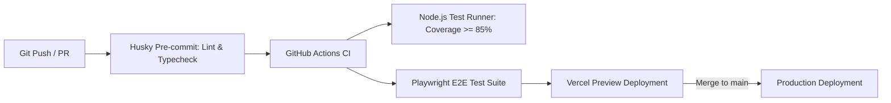

# App Architecture Plan: Business Helper

> **Technical Blueprint & Engineering Specification**
>
> A practical, opinionated architectural guide for scaffolding and extending **Business Helper** — an all-in-one business operations platform for Mexican SMBs. Grounded in Next.js 16 (App Router), React 19, Supabase, Tailwind CSS v4, and Stripe.

---

## 01 System Overview

Business Helper is an all-in-one, mobile-first business operations platform for small and medium businesses (SMBs) in Mexico. It streamlines quotes, agreements, accounts receivable, client management, and CFDI 4.0 electronic invoicing without complex ERP overhead. The application is designed for business owners and operational teams who need real-time cash flow visibility and fast, WhatsApp-native client interactions.

### Architecture Pattern

* **Type**: Modular Monolith on Serverless Edge Architecture (Next.js App Router + Supabase Backend-as-a-Service).
* **Key Components**:
  * **Frontend**: Next.js 16 React Server Components & Client Components with Tailwind CSS v4.
  * **Backend API**: Next.js Route Handlers + Supabase Database Functions & Webhooks.
  * **Database**: PostgreSQL (hosted on Supabase Cloud) with Row-Level Security (RLS).
  * **Background Jobs**: Vercel Cron Jobs + Supabase Database Triggers / Edge Functions.
  * **External Services**: Facturapi (SAT CFDI 4.0), Stripe (Billing/Subscriptions), Resend (Transactional Email), WhatsApp API / Deep-linking.

### System Diagram

```mermaid
graph TD
    User([Business Owner / Team Member]) -->|HTTPS / WSS| VercelEdge[Next.js App Router / Edge Network]
    ClientParty([Client / Recipient]) -->|HTTPS (Public Links)| VercelEdge

    subgraph Vercel Infrastructure
        VercelEdge --> SSR[React Server Components]
        VercelEdge --> API[Next.js API Route Handlers]
        API --> Cron[Vercel Cron / Reminders]
    end

    subgraph Supabase Cloud BaaS
        API -->|Supabase JS Client / Service Role| SupabaseAuth[Supabase Auth Engine]
        API -->|PostgREST / Direct SQL| PostgresDB[(Postgres DB + RLS)]
        API -->|S3 Protocol| StorageBucket[(Supabase Storage: Logos, Receipts, PDFs)]
    end

    subgraph External Services
        API -->|REST API| Facturapi[Facturapi (SAT CFDI 4.0 PAC)]
        API -->|REST / Webhooks| Stripe[Stripe Payments & Subscriptions]
        API -->|REST API| Resend[Resend Email API]
        VercelEdge -->|wa.me Deep-links| WhatsApp[WhatsApp Web / App Client]
    end
```

---

## 02 Data Model

### Core Entities

```
Organization
- id: uuid (PK, default: gen_random_uuid())
- name: text (not null)
- rfc: text (nullable)
- regimen_fiscal: text (nullable)
- codigo_postal: text (nullable)
- logo_url: text (nullable)
- industry: text (nullable)
- owner_id: uuid (FK -> auth.users.id, not null)
- stripe_customer_id: text (nullable)
- stripe_subscription_id: text (nullable)
- subscription_tier: enum ('free', 'emprendedor', 'negocio', 'empresa', default: 'free')
- subscription_status: text (default: 'active')
- facturapi_organization_id: text (nullable)
- created_at: timestamptz (default: now())
- updated_at: timestamptz (default: now())

OrganizationMember
- id: uuid (PK, default: gen_random_uuid())
- organization_id: uuid (FK -> organizations.id, not null)
- user_id: uuid (FK -> auth.users.id, not null)
- role: enum ('owner', 'manager', 'member', 'accountant', default: 'member')
- invited_at: timestamptz (default: now())
- created_at: timestamptz (default: now())

Client
- id: uuid (PK, default: gen_random_uuid())
- organization_id: uuid (FK -> organizations.id, not null)
- name: text (not null)
- contact_name: text (nullable)
- email: text (nullable)
- phone: text (nullable)
- rfc: text (nullable)
- regimen_fiscal: text (nullable)
- codigo_postal: text (nullable)
- cfdi_use: text (nullable)
- notes: text (nullable)
- health_score: int4 (default: 100)
- created_at: timestamptz (default: now())
- updated_at: timestamptz (default: now())

Product
- id: uuid (PK, default: gen_random_uuid())
- organization_id: uuid (FK -> organizations.id, not null)
- name: text (not null)
- description: text (nullable)
- unit_price: numeric(12,2) (not null)
- unit: text (default: 'E48') -- SAT unit code
- sat_product_code: text (default: '84111506') -- SAT product/service key
- stock_quantity: int4 (nullable) -- null for service businesses
- created_at: timestamptz (default: now())

Quote
- id: uuid (PK, default: gen_random_uuid())
- organization_id: uuid (FK -> organizations.id, not null)
- client_id: uuid (FK -> clients.id, not null)
- created_by: uuid (FK -> auth.users.id, not null)
- title: text (not null)
- line_items: jsonb (not null, default: '[]')
- subtotal_amount: numeric(12,2) (not null)
- iva_amount: numeric(12,2) (default: 0.00)
- retencion_isr_amount: numeric(12,2) (default: 0.00)
- retencion_iva_amount: numeric(12,2) (default: 0.00)
- total_amount: numeric(12,2) (not null)
- currency: enum ('MXN', 'USD', default: 'MXN')
- status: enum ('draft', 'sent', 'accepted', 'rejected', 'expired', 'converted', default: 'draft')
- valid_until: date (nullable)
- notes: text (nullable)
- public_token: text (unique, default: encode(gen_random_bytes(16), 'hex'))
- converted_contract_id: uuid (nullable)
- created_at: timestamptz (default: now())
- updated_at: timestamptz (default: now())

Contract (Agreement / Active Deal)
- id: uuid (PK, default: gen_random_uuid())
- organization_id: uuid (FK -> organizations.id, not null)
- quote_id: uuid (FK -> quotes.id, nullable)
- client_id: uuid (FK -> clients.id, not null)
- title: text (not null)
- scope_description: text (not null)
- total_amount: numeric(12,2) (not null)
- currency: enum ('MXN', 'USD', default: 'MXN')
- status: enum ('draft', 'sent', 'client_signed', 'accepted', 'completed', 'cancelled', default: 'draft')
- contract_hash: text (nullable) -- SHA-256 seal
- client_otp_code: text (nullable)
- client_otp_verified: boolean (default: false)
- client_otp_attempts: int4 (default: 0)
- accepted_at: timestamptz (nullable)
- accepted_by_name: text (nullable)
- accepted_ip: text (nullable)
- created_at: timestamptz (default: now())
- updated_at: timestamptz (default: now())

Milestone (Receivable Item)
- id: uuid (PK, default: gen_random_uuid())
- organization_id: uuid (FK -> organizations.id, not null)
- contract_id: uuid (FK -> contracts.id, not null)
- label: text (not null)
- amount: numeric(12,2) (not null)
- due_date: date (not null)
- status: enum ('pending', 'requested', 'marked_paid', 'confirmed', default: 'pending')
- receipt_url: text (nullable)
- tracking_reference: text (nullable) -- SPEI Clave de Rastreo
- cfdi_id: text (nullable)
- cfdi_status: enum ('none', 'pending', 'issued', 'failed', default: 'none')
- confirmed_at: timestamptz (nullable)
- created_at: timestamptz (default: now())

AuditLog
- id: uuid (PK, default: gen_random_uuid())
- organization_id: uuid (FK -> organizations.id, not null)
- contract_id: uuid (FK -> contracts.id, nullable)
- action: text (not null)
- actor: text (not null)
- details: text (not null)
- ip: text (nullable)
- created_at: timestamptz (default: now())
```

### Relationships

* **Organization → OrganizationMember**: One-to-many (org has multiple members).
* **Organization → Client**: One-to-many (org has multiple clients).
* **Organization → Product**: One-to-many (org maintains catalog of products/services).
* **Organization → Quote**: One-to-many.
* **Client → Quote**: One-to-many (client receives multiple quotes).
* **Quote → Contract**: One-to-one (optional, quote converts to contract).
* **Contract → Milestone**: One-to-many (contract contains multiple milestone receivables).

### Indexes & Constraints

* **`idx_org_members_lookup`**: `(organization_id, user_id)` (Unique, B-tree).
* **`idx_clients_org_id`**: `(organization_id, name)` (B-tree).
* **`idx_quotes_org_status`**: `(organization_id, status)` (B-tree).
* **`idx_milestones_due_status`**: `(organization_id, due_date, status)` (B-tree).
* **`quotes_public_token_key`**: `(public_token)` (Unique constraint).

---

## 03 API Design

All endpoints follow standard JSON payload conventions with unified error structures:
`{ "error": { "code": "STRING_CODE", "message": "Human readable message" } }`

### Organization & Team

```
POST /api/organization
Auth: required
Body: { name: string, rfc?: string, regimenFiscal?: string, industry?: string }
Response: { id: string, name: string, ownerId: string, createdAt: string }

GET /api/organization/members
Auth: required
Response: { members: Array<{ id: string, email: string, role: string, invitedAt: string }> }

POST /api/organization/members/invite
Auth: required (role: owner | manager)
Body: { email: string, role: 'manager' | 'member' | 'accountant' }
Response: { success: true, message: string }
```

### Quotes & Proposals

```
GET /api/quotes?status=draft|sent|accepted
Auth: required
Response: { quotes: Array<Quote>, totalCount: number }

POST /api/quotes
Auth: required
Body: { clientId: string, title: string, lineItems: Array<LineItem>, currency: 'MXN'|'USD', validUntil?: string }
Response: Quote

GET /api/quotes/:id
Auth: required (or public if valid public_token provided)
Response: Quote & { client: Client, organization: Organization }

POST /api/quotes/:id/convert
Auth: required
Body: { }
Response: { contractId: string, status: 'converted' }
```

### Accounts Receivable & Milestones

```
GET /api/receivables/summary
Auth: required
Response: { totalOverdue: number, totalDueToday: number, totalUpcoming: number, overdueCount: number }

POST /api/milestones/:id/request-payment
Auth: required
Body: { sendWhatsApp: boolean }
Response: { whatsappUrl: string, status: 'requested' }

POST /api/milestones/:id/confirm-payment
Auth: required
Body: { trackingReference?: string }
Response: { status: 'confirmed', confirmedAt: string }
```

### Clients (CRM-Lite)

```
GET /api/clients
Auth: required
Response: { clients: Array<Client> }

POST /api/clients
Auth: required
Body: { name: string, contactName?: string, email?: string, phone?: string, rfc?: string, regimenFiscal?: string }
Response: Client
```

### Invoicing & Billing (Facturapi & Stripe)

```
POST /api/invoices/issue
Auth: required (role: owner | manager | accountant)
Body: { milestoneId: string }
Response: { cfdiId: string, xmlUrl: string, pdfUrl: string, status: 'issued' }

POST /api/stripe/checkout
Auth: required (role: owner)
Body: { tier: 'emprendedor' | 'negocio' | 'empresa' }
Response: { checkoutUrl: string }

POST /api/webhooks/stripe
Auth: public (Stripe signature verification header required)
Body: Stripe Event Object
Response: { received: true }
```

---

## 04 Auth & Permissions

### Authentication

* **Provider**: Supabase Auth (scoped to single or multi-tenant database).
* **Methods**: Magic link (email) and Email/Password authentication.
* **Session Handling**: JWT access tokens in secure HTTP-only cookies (`sb-access-token`, `sb-refresh-token`) managed via Next.js Middleware (`@supabase/ssr`).

### Authorization & Multi-Tenancy

Every database query is automatically scoped to the active user's active Organization using **PostgreSQL Row-Level Security (RLS)**:

```sql
-- Security Function to get active user's organizations
CREATE OR REPLACE FUNCTION auth.user_organization_ids()
RETURNS SETOF uuid AS $$
  SELECT organization_id FROM organization_members WHERE user_id = auth.uid();
$$ LANGUAGE sql STABLE SECURITY DEFINER;

-- Sample RLS Policy for Clients table
ALTER TABLE clients ENABLE ROW LEVEL SECURITY;

CREATE POLICY "Users can access clients in their organizations"
ON clients FOR ALL
USING (organization_id IN (SELECT auth.user_organization_ids()));
```

### User Roles & Capabilities

| Role | Quote Management | Receivables & Payments | Team Management | Billing & Subscriptions | CFDI Stamping |
|:---|:---:|:---:|:---:|:---:|:---:|
| **Owner** | Full | Full | Full | Full | Full |
| **Manager** | Full | Full | Invite Member/Accountant | View Only | Full |
| **Member** | Create / Edit | View / Request | None | None | None |
| **Accountant** | View Only | Confirm Payment | None | View Only | Full |

### Public Routes (No Auth Required)

* `/` (Landing page)
* `/login`, `/register`, `/forgot-password`
* `/q/[public_token]` (Public Quote view for client signature/approval)
* `/c/[id]` (Public Client Contract portal for OTP signing & receipt upload)
* `/api/webhooks/*` (Stripe & Facturapi webhooks)

---

## 05 Third-Party Services

| Service | Purpose | SDK / Package | Environment Variables | Failure Handling |
|:---|:---|:---|:---|:---|
| **Supabase Cloud** | Postgres DB, Auth Engine, Object Storage | `@supabase/supabase-js`, `@supabase/ssr` | `NEXT_PUBLIC_SUPABASE_URL`, `NEXT_PUBLIC_SUPABASE_ANON_KEY`, `SUPABASE_SERVICE_ROLE_KEY` | Graceful fallback error response; retry logic on network timeouts |
| **Facturapi** | SAT CFDI 4.0 PAC Electronic Invoicing | REST via `lib/pacClient.ts` (no SDK) | `FACTURAPI_SECRET_KEY` (platform account), `PAC_ENCRYPTION_KEY` (seals tenant keys) | Record `cfdi_status: 'failed'` with the PAC's own message, release the reserved folio, and surface it for retry. Never a simulated stamp. |
| **Stripe** | SaaS Subscription Management & Checkout | `stripe`, `@stripe/stripe-js` | `STRIPE_SECRET_KEY`, `NEXT_PUBLIC_STRIPE_PUBLISHABLE_KEY`, `STRIPE_WEBHOOK_SECRET` | Webhook retries; manual sync button in Admin settings |
| **Resend** | Transactional Emails (OTP, Notifications) | `resend`, `@react-email/components` | `RESEND_API_KEY` | Fallback to direct client-side WhatsApp link alert if email fails |
| **WhatsApp API** | Direct Click-to-Chat & Status Alerts | Direct URL construction (`wa.me/`) | N/A (Standard URL protocol) | Fallback to copyable URL link if popup blocked |

---

## 06 Frontend Architecture

### Tech Choices

* **Framework**: Next.js 16.2+ (App Router).
* **UI Components**: Custom primitives using Tailwind CSS v4 + Lucide React Icons.
* **Styling**: Tailwind CSS v4 with CSS variables.
* **State Management**: React 19 hooks (`useContext`, `useOptimistic`, `useActionState`) + Custom Domain Hooks (`useQuotes`, `useReceivables`, `useClients`).

### Page Structure & Routing Map

```
app/
├── (auth)/
│   ├── login/page.tsx             # Login View
│   ├── register/page.tsx          # Business Registration View
│   └── onboarding/page.tsx        # Business Setup Wizard
├── (dashboard)/
│   ├── layout.tsx                 # AppShell with Sidebar + Header
│   ├── dashboard/page.tsx         # Centro de Control (Owner Dashboard)
│   ├── quotes/page.tsx            # Quotes & Proposals List & Wizard
│   ├── receivables/page.tsx       # Accounts Receivable Kanban / List
│   ├── clients/page.tsx           # Client Directory (CRM-lite)
│   ├── products/page.tsx          # Product & Service Catalog
│   ├── team/page.tsx              # Team Members & Roles
│   └── settings/page.tsx          # Business & Billing Settings
├── q/
│   └── [token]/page.tsx           # Public Client Quote Approval View
├── c/
│   └── [id]/page.tsx              # Public Contract Signing & Payment Upload Portal
└── page.tsx                       # Public Landing Page
```

### Data Fetching & Rendering Strategy

* **Server Components (RSC)**: Used for initial page renders (`/dashboard`, `/quotes`, `/receivables`) to fetch server-side state directly from Supabase with zero client-side waterfall.
* **Client Components**: Used for interactive forms (Quote Wizard, Payment Confirmation Modal, Filters).
* **Data Dispatcher**: `lib/storageClient.ts` abstracts calls between browser LocalStorage (Demo Mode) and Supabase cloud.

---

## 07 Infrastructure & Deployment

### Hosting & Infrastructure Setup

* **Frontend & Edge Routing**: Vercel Platform (Production & Branch Preview Deployments).
* **Database & Auth**: Supabase Cloud (Managed Postgres AWS Region `us-east-1`).
* **File Storage**: Supabase Storage Buckets (`logos`, `signatures`, `spei-receipts`).

### CI/CD Pipeline



### Environment Variables Matrix

| Category | Variable Name | Public / Secret | Description |
|:---|:---|:---:|:---|
| **Core App** | `NEXT_PUBLIC_APP_URL` | Public | Base URL (e.g. `https://businesshelper.mx`) |
| **Database & Auth**| `NEXT_PUBLIC_SUPABASE_URL` | Public | Supabase Endpoint URL |
| **Database & Auth**| `NEXT_PUBLIC_SUPABASE_ANON_KEY` | Public | Supabase Anonymous Client Key |
| **Database & Auth**| `SUPABASE_SERVICE_ROLE_KEY` | **Secret** | Supabase Admin Bypass Key (Server API routes only) |
| **Payments** | `NEXT_PUBLIC_STRIPE_PUBLISHABLE_KEY` | Public | Stripe Client Key |
| **Payments** | `STRIPE_SECRET_KEY` | **Secret** | Stripe API Secret Key |
| **Payments** | `STRIPE_WEBHOOK_SECRET` | **Secret** | Webhook Validation Secret |
| **Invoicing** | `FACTURAPI_SECRET_KEY` | **Secret** | Facturapi PAC Key |
| **Email** | `RESEND_API_KEY` | **Secret** | Transactional Email Key |

---

> **Implementation Note for AI Assistants & Engineers**: When implementing new features, always adhere to the RLS multi-tenant organization scoping (`organization_id`), write unit tests to maintain the 85% coverage threshold, and enforce Tailwind CSS v4 design tokens.
