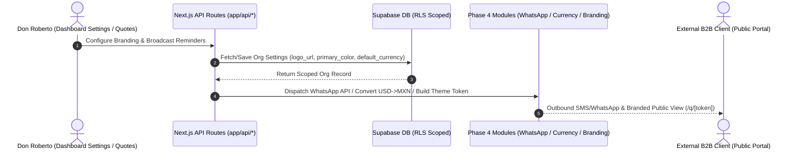

# Feature Implementation Spec: Phase 4 Post-Launch Expansion — Outbound WhatsApp API, Multi-Currency (USD/MXN) & White-Labeling

> **Single-Session AI & Engineering Implementation Spec**
>
> A focused specification for executing **Phase 4 Post-Launch Expansion** of **Business Helper** following the **Everything Claude Code (ECC) 4-Phase Execution Playbook**.

---

## 01 Feature Summary

* **Feature Name**: Phase 4 Post-Launch Expansion — Outbound Automated WhatsApp API Engine (Twilio / Meta), Multi-Currency Engine (MXN / USD), and White-Labeling & Organization Branding Engine.
* **Target Module**: Messaging (`/lib/whatsappOutbound.ts`, `/api/whatsapp/broadcast`), Financial Engine (`/lib/currency.ts`, `/lib/quotes.ts`, `/lib/receivables.ts`), Branding (`/lib/branding.ts`, `/app/q/[token]/page.tsx`, `/app/pay/[token]/page.tsx`), and Settings (`/app/dashboard/settings/page.tsx`).
* **Primary User**: Business Owners ("Don Roberto"), Operations Managers ("Lic. Mariana"), & External Clients.
* **Goal**: Expand Business Helper's competitive advantages with direct outbound automated WhatsApp payment reminders, multi-currency invoicing (USD/MXN) for international B2B clients, and custom logo/color white-labeling on public quote and payment portals.

### Scope Boundaries
* **In Scope**:
  1. **Outbound Automated WhatsApp API Engine (P0)**:
     - Build `/lib/whatsappOutbound.ts` to construct Twilio / Meta WhatsApp API message dispatch payloads with dynamic template variables and automatic fallback to `wa.me/` Click-to-Chat deep links.
     - Build `/app/api/whatsapp/broadcast/route.ts` to handle manual and scheduled automated payment reminder dispatches scoped to `organization_id`.
  2. **Multi-Currency Engine (USD / MXN) (P0)**:
     - Build `/lib/currency.ts` to manage currency formatting (`$1,500.00 MXN`, `$100.00 USD`), dynamic exchange rate conversion, and currency symbol resolution.
     - Update `/lib/quotes.ts` and `/lib/receivables.ts` to handle multi-currency quotes and receivables summaries with exchange rate conversions.
  3. **White-Labeling & Organization Branding Engine (P1)**:
     - Build `/lib/branding.ts` to generate dynamic CSS custom properties (`--primary-color`), logo fallback assets, and custom header/footer metadata.
     - Update `/app/q/[token]/page.tsx` (Public Quote Portal) and `/app/pay/[token]/page.tsx` (Public SPEI Portal) to apply dynamic company logo, custom color theme, and tagline.
     - Update `/app/dashboard/settings/page.tsx` to include Branding Customizer (logo URL, primary color picker) and Currency preferences.
  4. **Unit & Integration Test Suites in `scripts/test-runner.js`**:
     - Add Suite 31 (Outbound WhatsApp API Engine), Suite 32 (Multi-Currency Engine), and Suite 33 (White-Labeling & Branding Engine).

---

## 02 Acceptance Criteria (P0 / P1)

### Must-Have (P0 / P1)
- [ ] **AC 1.1**: Outbound WhatsApp engine (`lib/whatsappOutbound.ts`) formats API broadcast payloads for overdue reminders and falls back gracefully to `wa.me/` links when API keys are absent.
- [ ] **AC 1.2**: `/api/whatsapp/broadcast` validates user authentication, verifies tenant `organization_id`, and dispatches message notifications.
- [ ] **AC 1.3**: Currency helper (`lib/currency.ts`) formats MXN and USD amounts correctly and applies conversion rates (`1 USD = 18.50 MXN` default).
- [ ] **AC 1.4**: Receivables calculator (`lib/receivables.ts`) aggregates multi-currency milestone totals into unified base-currency reports.
- [ ] **AC 1.5**: Branding engine (`lib/branding.ts`) generates custom CSS variables and fallback logo tokens for tenant branding.
- [ ] **AC 1.6**: Public Quote (`/q/[token]`) and Payment (`/pay/[token]`) portals render custom organization logos and theme colors when configured.
- [ ] **AC 1.7**: All test suites (1 to 33) in `scripts/test-runner.js` pass with 100% success rate.
- [ ] **AC 1.8**: `npm run typecheck` and `npm test` complete with 0 errors and 0 warnings.

---

## 03 Mobile UX Rules (Don Roberto Persona Constraints)

1. **Touch Target Size**: Touch targets on settings controls, broadcast dispatch buttons, and currency selectors MUST be >= **48px** (`min-h-[48px]`, `py-3`).
2. **Clear Visual Differentiation**: Display clear currency tags (`MXN` vs `USD`) with flag indicators or badge labels so Don Roberto never confuses pesos with dollars.
3. **Seamless Branding Preview**: Live color swatch picker and logo preview in `/dashboard/settings` so owners immediately see how their public quotes will look to clients.

---

## 04 Technical Implementation & Files

### Exact Files to Create / Modify

#### Outbound Messaging Engine
* `lib/whatsappOutbound.ts` — Outbound message dispatcher, template formatter & fallback handler.
* `app/api/whatsapp/broadcast/route.ts` — Outbound reminder broadcast API endpoint.

#### Multi-Currency Engine
* `lib/currency.ts` — Multi-currency formatter, ISO code helpers & exchange rate converter.
* `lib/quotes.ts` — Updated quote totals calculator with multi-currency & exchange rate support.
* `lib/receivables.ts` — Updated receivables summary calculator with multi-currency aggregation.

#### White-Labeling & Branding Engine
* `lib/branding.ts` — Organization theme customizer, logo manager & CSS token generator.
* `app/q/[token]/page.tsx` — Public Quote Portal with dynamic white-label theme rendering.
* `app/pay/[token]/page.tsx` — Public SPEI Portal with dynamic white-label theme rendering.
* `app/dashboard/settings/page.tsx` — Dashboard settings with Branding & Currency customizer.

#### Test Suite
* `scripts/test-runner.js` — Add Suite 31 (Outbound WhatsApp API), Suite 32 (Multi-Currency Engine), and Suite 33 (White-Labeling & Branding).

---

## 05 Data Flow Patterns & Multi-Tenancy Scoping

### Multi-Tenancy Rules
1. Every server API route (`app/api/*`) MUST obtain user context via `supabase.auth.getUser()`.
2. Every branding config, currency preference, and WhatsApp broadcast MUST be isolated to `organization_id`.
3. Public quote/payment views (`/q/[token]`, `/pay/[token]`) MUST read organization branding associated with the quote/contract owner.

---

## 06 4-Phase Execution Checklist

- [ ] **Phase 1: Planning & Architecture**: Updated `feature_implementation_spec.md` and `implementation_plan.md`.
- [ ] **Phase 2: TDD (Test-Driven Development)**: Add failing unit tests to `scripts/test-runner.js` for Outbound WhatsApp, Multi-Currency, and White-Labeling. Verify Red phase.
- [ ] **Phase 3: Implementation & Security Review**: Implement outbound messaging, currency converter, branding engine, public view white-labeling, and settings UI.
- [ ] **Phase 4: Verification & Quality Gates**: Run `npm run typecheck` and `npm test` ensuring 0 errors/warnings. Commit code.

