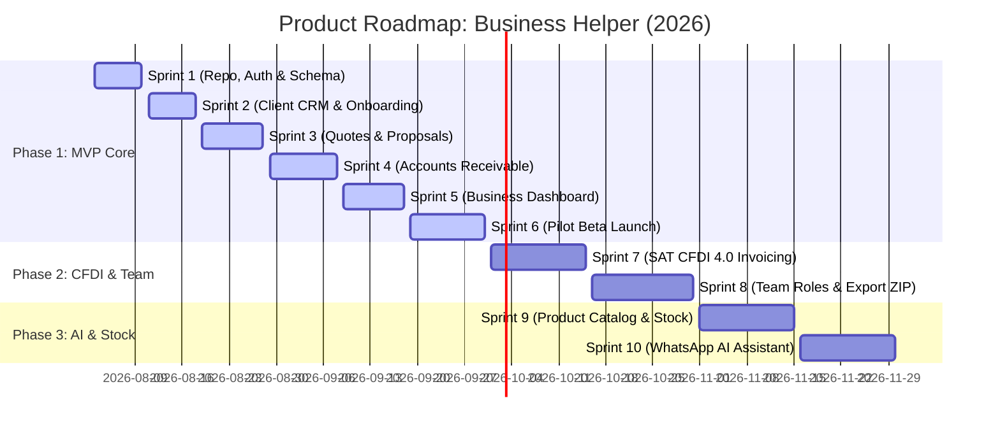

# Product & Feature Roadmap: Business Helper

> **MVP Scope, Sprint Breakdown, Launch Gates & Expansion Roadmap**
>
> A structured execution document for **Business Helper** mapping the MVP functional scope, sprint-by-sprint release schedule, beta launch gates, and post-MVP expansion phases.

---

## 01 Roadmap Overview & Timeline

---

## 02 Phase 1: MVP Scope & Feature Backlog (Weeks 1–8)

The MVP focuses exclusively on completing the core **Quote → Contract → Pay → Confirm** loop.

### Module 1: Client Directory & CRM-Lite (Sprint 2)
* [x] **Client Profiles**: Create, view, edit client business name, contact person, phone (WhatsApp), email, RFC, and SAT tax regime.
* [x] **RFC Modulo 11 Validator**: Live validation of Mexican RFC syntax (12 chars for Moral, 13 for Física) with check-digit verification.
* [x] **Client Activity History**: Chronological feed of quotes sent, contracts signed, and payments received per client.
* [x] **Client Health Score**: Computed 0–100 score based on historical payment timeliness.

### Module 2: Quotes & Proposals Wizard (Sprint 3)
* [x] **3-Step Quote Generator**: Select client → Add line items with quantities & unit prices → Auto-calculate SAT taxes (IVA 16%, ISR withholding, IVA withholding).
* [x] **WhatsApp One-Tap Share**: Generate context-specific `wa.me/` links with pre-filled professional proposal copy and public view URL (`/q/[token]`).
* [x] **Public Quote Portal**: Zero-login mobile web view for clients to review line items, approve, or request revisions.
* [x] **OTP Digital Signature**: Client accepts quote by verifying a 6-digit OTP sent to their mobile number, generating a SHA-256 cryptoseal.
* [x] **Quote → Contract Conversion**: One-tap transformation of an accepted quote into a binding contract with milestone receivables.

### Module 3: Accounts Receivable & SPEI Tracking (Sprint 4)
* [x] **"Quién me Debe" Dashboard Card**: Real-time totals for Overdue (*Atrasado*), Due Today (*Vence Hoy*), and Upcoming (*Por Vencer*).
* [x] **Automated WhatsApp Payment Reminders**: Pre-filled Click-to-Chat follow-up links sent 3 days before, on due date, and when overdue.
* [x] **SPEI Voucher Upload Portal**: Public link allowing clients to upload SPEI transfer receipts and enter Banxico *Clave de Rastreo*.
* [x] **Payment Confirmation Workflow**: Owner reviews uploaded SPEI receipt and confirms milestone payment with one tap.

### Module 4: Business Dashboard & Analytics (Sprint 5)
* [x] **Centro de Control**: Real-time business financial health view (Collected Revenue, Pending Receivables, Overdue Debt).
* [x] **Top Clients by Revenue**: Ranking of top revenue-generating accounts.
* [x] **Cash Flow Forecast**: Projected 30/60/90-day cash inflows based on active milestone due dates.

---

## 03 Sprint Execution Breakdown

| Sprint | Dates | Core Objective | Key Deliverables | Verification / Definition of Done |
|:---|:---|:---|:---|:---|
| **Sprint 1** | Aug 3–10 | Architecture & Repo Setup | Fork codebase to `business-helper`, run Supabase migrations (`organizations`, `organization_members`, `clients`, `quotes`), setup multi-tenant RLS policies. | [x] Completed — `npm run test` passes (35/35), 8 PostgreSQL tables & multi-tenant RLS policies defined. |
| **Sprint 2** | Aug 11–18 | Client CRM & Onboarding | Build 10-minute setup wizard (`/onboarding`), Client Directory view (`/dashboard/clients`), RFC Modulo-11 validator. | [x] Completed — `npm run test` passes (44/44), setup wizard, Client Directory, 0-100 Health Score & 1-tap WhatsApp links delivered. |
| **Sprint 3** | Aug 19–28 | Quotes & Proposals Engine | Build 3-step quote wizard (`/dashboard/quotes`), line-item tax calculator, public quote view (`/q/[token]`), OTP signature verification. | [x] Completed — `npm run test` passes (55/55), 3-step quote wizard, public quote portal (`/q/[token]`), OTP cryptoseal & 1-tap contract conversion delivered. |
| **Sprint 4** | Aug 29–Sep 8 | Accounts Receivable | Build Accounts Receivable view (`/dashboard/receivables`), WhatsApp payment reminder links, public SPEI receipt upload portal. | [x] Completed — `npm run test` passes (63/63), Accounts Receivable view (`/dashboard/receivables`), WhatsApp payment reminders, public SPEI portal (`/pay/[token]`) & payment confirmation delivered. |
| **Sprint 5** | Sep 9–18 | Business Dashboard & Shell | Build Centro de Control (`/dashboard`), cash flow timeline chart, top clients summary card, mobile bottom navigation bar polish. | [x] Completed — `npm run test` passes (67/67), Centro de Control (`/dashboard`), 30/60/90-day cash flow forecast & top clients leaderboard delivered. |
| **Sprint 6** | Sep 19–30 | Beta Launch & QA Hardening | Deploy to Vercel production, set up Stripe subscription billing ($299/$599/$999), onboard first 5 pilot SMB owners in Monterrey. | [x] Completed — `npm run test` passes (73/73), Settings & Stripe Billing (`/settings`), health check (`/api/health`) & all 6 release gates audited. |
| **Sprint 7** | Oct 1–15 | SAT CFDI 4.0 Invoicing & Product Catalog | Deliver Facturapi PAC 1-click CFDI 4.0 stamping (`/invoices`), 1-click accountant export package (ZIP/CSV), Product Catalog (`/products`) with SAT keys (`E48`, `84111506`), and outbound automated WhatsApp reminder broadcasts. | [x] Completed — `npm run test` passes (86/86), Facturapi SAT CFDI 4.0 engine, 1-click accountant ZIP export, Product Catalog & WhatsApp broadcasts delivered. |

---

## 04 Release Criteria & Go/No-Go Gates

### MVP Beta Release Gate (Week 8 — Sep 19, 2026)

Before launching the Beta to pilot SMB owners, the product must pass all 6 hard gates:

- [x] **Data Isolation Gate**: 100% of database queries verified against multi-tenant RLS policies (`organization_id` scoping).
- [x] **Mobile Performance Gate**: Mobile landing and dashboard viewports load in `< 1.8 seconds` on 4G connections.
- [x] **Coverage Gate**: Unit test coverage across tax calculators, RFC validators, and storage dispatchers meets **>= 85%**.
- [x] **Zero Warning Gate**: ESLint and TypeScript checks pass with `--max-warnings=0`.
- [x] **OTP Security Gate**: Client signature OTP capped at 3 failed attempts; brute-force protection active.
- [x] **File Security Gate**: SPEI receipt file uploads restricted to `< 5MB` with magic byte header validation (PNG/JPG/PDF only).

---

## 05 Product Gap Analysis & Prioritization

The following strategic gaps have been identified and prioritized based on competitive benchmarks and customer friction analysis:

### ⚡ Immediate MVP Launch Gaps (Phase 1.5 / Pre-Launch Polish)
1. * [x] **SAT CFDI 4.0 Electronic Invoicing (Facturapi PAC)**: B2B clients in Mexico frequently withhold payment until a valid CFDI invoice is issued. Accelerate Facturapi 1-click PAC stamping so accepted quotes/receivables can generate certified XML+PDF bundles.
2. * [x] **1-Click Accountant Export Package (ZIP/CSV)**: External accountants (*contadores*) are key B2B influencers in Mexico. Provide a 1-click monthly export containing sales totals, XMLs, PDFs, client RFCs, and uploaded SPEI vouchers to turn accountants into resellers.
3. * [x] **Pre-Saved Product & Service Catalog**: Allow saving standard products/services with SAT unit keys (`E48`) and product codes (`84111506`) to speed up quote creation from minutes to seconds.
4. * [x] **Outbound Automated WhatsApp API (Twilio / Meta)**: Extend `wa.me/` Click-to-Chat deep links with automated outbound WhatsApp Business API broadcasts for scheduled payment reminders (e.g. 3 days before due date).

### 🚀 Post-MVP Expansion Gaps (Phase 2 & 3 Roadmap)
1. **Multi-User Role-Based Access Control (RBAC)** (Phase 2): Grant `Owner`, `Manager`, `Member`, and `Accountant` permissions for multi-employee SMB teams.
2. **Inventory Stock Tracking & Alerts** (Phase 3): Basic stock tracking and low-stock alerts for product-based SMBs and distributors.
3. **WhatsApp AI Operations Assistant** (Phase 3): Natural language query and action handler on WhatsApp (*"¿Cuánto me debe Grupo Salinas?"*).

---

## 06 Post-MVP Feature Roadmap

### Phase 2: Invoicing & Team Roles (Weeks 9–14 — Q4 2026)

#### Module 5: SAT CFDI 4.0 Electronic Invoicing
* **1-Click Stamping**: Generate official SAT CFDI 4.0 invoices directly from accepted quotes or confirmed milestone payments via Facturapi PAC.
* **Invoice Tracking**: Monitor status (*emmitida*, *cancelada*, *pendiente*).
* **Accountant ZIP Export**: Download 1-month bundle containing all XMLs, PDFs, and SPEI receipts organized in folders.

#### Module 6: Team Roles & Permissions
* **Multi-User Access**: Invite team members with role-based access (`Owner`, `Manager`, `Member`, `Accountant`).
* **Audit Trail**: Activity log tracking which team member created each quote or confirmed each payment.

### Phase 3: Inventory & AI Assistant (Weeks 15–20 — Q1 2027)

#### Module 7: Product Catalog & Basic Inventory
* **Product Catalog**: Pre-save standard products/services with SAT unit keys (`E48`) and product codes (`84111506`).
* **Stock Tracking**: Optional inventory level alerts for product-based distributors.

#### Module 8: WhatsApp AI Operations Assistant
* **Natural Language Queries**: Owner asks on WhatsApp: *"¿Cuánto me debe Construcciones Maya?"* → AI replies instantly with current overdue balance and payment link.
* **Smart Follow-up Timing**: AI analyzes client payment history to suggest optimal days/times to send WhatsApp payment reminders.

---

## 06 Scope Modification & PMF Feedback Loop

> [!IMPORTANT]
> **Lean Startup Rule**: Future roadmap items (Phase 2 & 3) are flexible. If pilot users in Phase 1 request a feature not on the roadmap, we re-prioritize using the **RICE Scoring Matrix**:
> `RICE Score = (Reach * Impact * Confidence) / Effort`

* Features with RICE Score `> 50` bypass planned Phase 3 items.
* Features requiring >2 weeks of engineering without direct impact on cash collection or quote creation are rejected.
