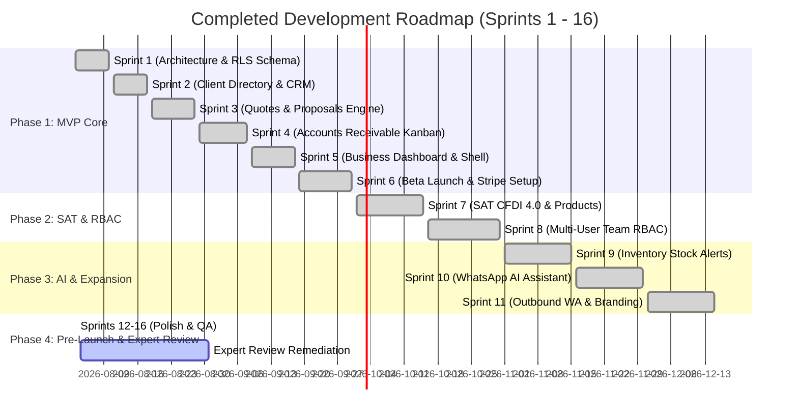

# Product Readiness & Roadmap Execution Snapshot: Business Helper

> **Executive Readiness Summary, Technical Audit, Expert Review Integration & Launch Action Plan**
>
> *Document Created: 2026-08-03 | Updated: 2026-08-07 (Post Security Review — status claims corrected)*
> *Target Launch Target: September 2026 (Monterrey Pilot Launch)*
> *Expert Review Score: 5.35 / 10 (Launch) | 4.75 / 10 (Mobile)*

> [!CAUTION]
> **This document's original status dashboard was inaccurate and has been corrected.** A security review
> on 2026-08-06 found that several features recorded here as "100% Complete" were **simulated** — the UI
> and data model existed, but the third-party call underneath was faked. Most seriously, CFDI stamping
> fabricated invoice IDs and URLs while writing `cfdi_status: 'issued'`, so the product could show a
> business owner a SAT invoice that never existed.
>
> **[`launch_readiness_memo_aug2026.md`](launch_readiness_memo_aug2026.md) is the current source of truth**
> for launch status and supersedes this document wherever the two conflict. The module capability
> descriptions in §02 below remain broadly accurate as *scope*; treat them as claims about what is built,
> not evidence that each integration has executed against its real service.

---

## 01 Executive Status Dashboard

*Corrected 2026-08-07 against `main` @ `5c35719`. See the memo §06 for the verification method.*

| Metric / Dimension | Status | Verified Details |
| :--- | :---: | :--- |
| **Feature Scope Built** | 🟢 **Sprints 1–16** | All planned modules exist in `main`. "Built" ≠ "integration verified" — see the two rows below. |
| **Money-Path Integrity** | 🔴 **Remediation in flight** | CFDI stamping was simulated (issue #3, PR #23 unmerged, never run against a live PAC). Stripe checkout, team invites and accountant export were simulated and are now real (PR #19). |
| **E-Signature (OTP) Delivery** | 🔴 **Not operational** | Provider code merged (PR #16) but no credentials configured; per-recipient rate limiting still unmerged (issue #17 / PR #20). The signing flow cannot function today. |
| **Automated Test Suite** | 🟢 **383 / 383** | 58 files passing via `npx vitest run`. *(`scripts/test-runner.js` was retired in PR #21 — any doc citing it or a count of 144/175/182 is stale.)* |
| **Code Quality & Linter** | 🟢 **Zero Warnings** | `npm run typecheck` and `npm run lint` pass. CI enforces on push (`.github/workflows/ci.yml`). |
| **Multi-Tenant Security** | 🟢 **Audited** | RLS active on all multi-tenant tables; API auth enforcement added in PR #1. See [`security-p0-remediation.md`](../security-p0-remediation.md). |
| **Error Monitoring** | 🔴 **Not live** | No `@sentry/nextjs` dependency. `lib/sentry.ts` `captureException` only writes to `console.error`; nothing is transmitted. Prior "Sentry Monitoring Live" claims were incorrect. |
| **Expert Review: Launch Readiness** | 🔴 **5.35 / 10** | Scored credibility (3/10), conversion funnel (4/10), UX polish (5/10). Predates the findings above and assessed the landing page only. |
| **Expert Review: Mobile Score** | 🔴 **4.75 / 10** | Typography (4/10), performance (4/10), in-app browser compat (4/10). Requires hardening before paid ads. |
| **Launch Phase** | 🟡 **Pre-Beta Remediation** | Blocked on the P0 stack in [`launch_readiness_memo_aug2026.md`](launch_readiness_memo_aug2026.md) §03. |

---

## 02 Completed Sprint Breakdown & Capabilities Matrix (Sprints 1–16)



### Module Capabilities Summary

#### 1. Core CRM & Client Directory (`/dashboard/clients`)
* Live Mexican RFC Modulo 11 check-digit syntax validation (12 chars Moral, 13 chars Física).
* 0–100 Client Health Score based on historical payment timeliness.
* Chronological activity feed for quote approvals, contract signatures, and payments.

#### 2. Quote & Contract Engine (`/dashboard/quotes`, `/q/[token]`)
* 3-step quote generator with SAT tax calculation (16% IVA, ISR withholding, IVA withholding).
* Public zero-login quote portal (`/q/[token]`) with mobile-first responsive layout.
* 6-digit OTP phone verification generating a SHA-256 cryptosealed digital signature.
* One-tap contract conversion with milestone payment splitting.

#### 3. Accounts Receivable & SPEI Portal (`/dashboard/receivables`, `/pay/[token]`)
* Real-time debt Kanban (*Atrasado*, *Vence Hoy*, *Por Vencer*).
* Public SPEI receipt upload portal (`/pay/[token]`) with Banxico *Clave de Rastreo* logging.
* File security guardrails enforcing `< 5MB` magic-byte validation (PNG/JPG/PDF).
* One-tap owner payment confirmation workflow.

#### 4. Business Dashboard & Control Center (`/dashboard`)
* Total collected revenue, pending receivables, and overdue balances summary cards.
* 30/60/90-day cash flow projection chart based on contract milestone due dates.
* Top clients by revenue leaderboard.

#### 5. Zero-Friction Invoicing & Accountant Tools (`/invoices`)
* **Nota de Venta & Recibo de Pago PDF Engine** (`lib/receiptGenerator.ts`): 1-click printable/downloadable receipt with tenant branding and tax breakdowns without needing SAT CSD digital certificates or PAC credentials.
* **1-Click Accountant Export Package** (`lib/accountantExport.ts`): Structured CSV summaries and organized ZIP downloads for external accountants (*contadores*).
* **CFDI 4.0 Pay-Per-Folio Add-on**: PAC API Key integration for self-service CFDI 4.0 XML+PDF stamping available across all plans. Users connect their own PAC (Facturama, FiscalAPI, SW Sapien) — Business Helper never stores CSD certificates. See [cfdi_integration_architecture.md](../../docs/02-architecture/cfdi_integration_architecture.md).
* Pre-saved product catalog with SAT unit keys (`E48`) and product codes (`84111506`).

#### 6. Enterprise Roles, AI & Operations (`/team`, `/assistant`, `/products`, `/settings`)
* Multi-user Role-Based Access Control (`Owner`, `Manager`, `Member`, `Accountant`).
* Inventory stock tracking with low-stock warnings (`<= 5 units`) and automatic deduction.
* Natural language WhatsApp AI Assistant powered by Gemini API for debt inquiry parsing.
* **1-Tap `wa.me/` WhatsApp Integration**: Zero-cost, zero-API dependency Click-to-Chat deep links sending pre-filled messages directly from the owner's WhatsApp number.
* USD / MXN multi-currency engine with automated base-currency aggregation.
* White-label branding customizer generating CSS variables for tenant logo, colors, and header themes.

---

## 03 Expert Review Findings & Remediation Status

> [!WARNING]
> An independent product expert and two UX/UI audit reviews evaluated the landing page, conversion funnel, and trust posture in August 2026. The complete analyses are archived in [product_expert_review_aug2026.md](../../docs/04-execution-testing/product_expert_review_aug2026.md) and tracked in [product_readiness_workback.md](../../docs/04-execution-testing/product_readiness_workback.md).

### Critical Issues (🔴 Launch Blockers)

| Issue | Expert Score Impact | Resolution | Status |
|---|---|---|---|
| Stock photo duplication across hero & testimonials | Credibility: 3/10 | Ensure avatar images are distinct; replace placeholders with real/illustrative profiles | 🔲 Pending |
| Broken / missing core routes (`/pricing`, `/demo`, `/login`) | Conversion: 4/10 | Build functional login form, pricing route, and demo route/redirects | 🔲 Pending |
| Footer signup submit button is raw `/register` link | Conversion: 4/10 | Replace raw link submit with proper POST handler to prevent typed data loss | 🔲 Pending |
| Premature RFC demand at initial signup | Conversion: 4/10 | Defer RFC to progressive profiling during first invoice (*timbrado*) | 🔲 Pending |
| Concatenated double-H1 bug in hero section | Technical UX: 5/10 | Enforce single canonical H1 in DOM | 🔲 Pending |
| Visible raw asset paths & stray status bar text | Visual Craft: 5/10 | Clean visible DOM text of video paths (`/assets/demo/...`) and `9:41` timestamps | 🔲 Pending |
| Technical cryptography jargon overload | Copywriting: 6/10 | Translate `SHA-256`, empty string hash, `Cryptoseal`, `multitenant`, `RLS` to plain legal claims | 🔲 Pending |

### Medium Issues (🟡 Conversion Optimization & Mobile Polish)

| Issue | Resolution | Status |
|---|---|---|
| Self-issued "Verificado en Producción" badges | Replace with externally anchored trust marks (PAC partner logo, SSL lock seal) | 🔲 Pending |
| Missing sticky navigation bar & section anchors | Implement persistent header with section links (Producto, Precios, Demo, Casos de Uso) | 🔲 Pending |
| Missing Cookie Consent banner & Terms link | Add LFPDPPP-compliant cookie banner and footer link to `/terms` | 🔲 Pending |
| Competitor comparison legal & accuracy exposure | Soften claims or use generic category descriptors ("Sistemas de escritorio tradicionales") | 🔲 Pending |
| Domain split between `.app` and `.mx` | Align 301 redirects, canonical tags, and OG sharing meta tags | 🔲 Pending |
| Pricing table buried at Section 13 | Move pricing section higher on landing page (Section 3-4) | 🔲 Pending |

---

## 04 Pre-Launch Action Plan (Updated Post Expert Review)

The workback is now organized into 3 phases with hard gates. Full details in [product_readiness_workback.md](../../docs/04-execution-testing/product_readiness_workback.md).

```
┌────────────────────────────────────────────────────────────────────────────────┐
│                    POST-EXPERT-REVIEW EXECUTION ROADMAP                        │
└────────────────────────────────────────────────────────────────────────────────┘
                                        │
     ┌──────────────────┬───────────────┼───────────────┬──────────────────┐
     ▼                  ▼               ▼               ▼                  ▼
┌─────────┐        ┌─────────┐     ┌─────────┐     ┌─────────┐        ┌─────────┐
│ Phase 1  │        │ Phase 1  │     │ Phase 1  │     │ Phase 2  │        │ Phase 3  │
│ WS-A     │        │ WS-B     │     │ WS-C     │     │ WS-D/E/F │        │ WS-G/H/I │
│ Trust &  │        │ CFDI     │     │ Signup & │     │ Mobile,  │        │ Acctg,   │
│ Credibil │        │ Pricing  │     │ Legal    │     │ SEO,Demo │        │ Bank,Ref │
│ (Wk 1-2) │       │ (Wk 1-2) │     │ (Wk 1-2) │    │ (Wk 3-4) │       │ (Mo 2-3) │
└─────────┘        └─────────┘     └─────────┘     └─────────┘        └─────────┘
     │                                                    │                  │
     ▼                                                    ▼                  ▼
 🚪 Gate 1                                           🚪 Gate 2          🚪 Gate 3
 Credibility ≥ 7.0                                   Mobile ≥ 6.0       Paid Ads
 (Aug 17)                                            (Aug 31)           Go/No-Go
```

### Workstream 1: Production Infrastructure & Secrets Configuration
- [ ] **Stripe Live Enablement**: Checkout is implemented as raw REST against `api.stripe.com/v1` (`lib/stripeClient.ts`; there is no `stripe` SDK dependency). **Unverified:** live keys and price IDs mapped, and webhook signature enforcement confirmed against a staging account (`npm run verify:webhook`).
- [ ] **OTP Delivery Provider**: Code merged for Twilio SMS / Twilio WhatsApp / Meta Cloud API (`lib/otpDelivery.ts`), **no credentials configured**. Blocks the e-signature flow entirely. See issue #2.
- [x] **Outbound WhatsApp Dispatch**: Real sends via Twilio / Meta (PR #13), plus zero-cost `wa.me/` Click-to-Chat deep links for owner-initiated messages.
- [x] **Default Invoicing Engine**: Nota de Venta PDF & Accountant ZIP Export operational (export reads real milestones as of PR #19).
- [ ] **Error Monitoring**: `lib/sentry.ts` is a console-only shim. Needs a real transport before launch.

### Workstream 2: Custom Domain, SSL & Webhook Alignment
- [ ] **Domain Decision**: Docs specify `businesshelper.mx`; recent commit history moved copy to `.app`. **Confirm which apex is actually registered** and set canonicals/redirects accordingly.
- [ ] **Vercel DNS Routing**: Apex A record and CNAME with SSL — unverified against the live project.
- [ ] **Callback & Webhook Sync**: Supabase Auth Site/Redirect URLs and the Stripe webhook endpoint must match the chosen domain.

### Workstream 3: Marketing Deliverables & Product Demo
- [ ] **Animated Demo Video**: Generate a 60–90 second motion graphics walkthrough: *Quote Creation → WhatsApp Share → OTP Cryptoseal → SPEI Receipt Upload → Confirmation*.
- [ ] **Landing Page Expert Review Fixes**: Apply all Phase 1 credibility and trust fixes per [workback](../../docs/04-execution-testing/product_readiness_workback.md).
- [ ] **Testimonial Replacement**: Replace placeholder initials with credible fictional profiles including full names, company names, industries, and avatar illustrations.

### Workstream 4: Operational Support & Monterrey Pilot Onboarding
- [ ] **WhatsApp Support Line**: Set up dedicated WhatsApp Business support channel.
- [ ] **Accountant Partner Network Pitch**: Outbound to 30 partner accounting firms.
- [ ] **Pilot SMB Onboarding**: Direct onboarding of initial 5 Monterrey pilot accounts.

### Workstream 5: CFDI Pricing Repositioning (NEW — Expert Review)
- [ ] **Resolve FAQ/Pricing contradiction**: Align all copy with pay-per-folio add-on model.
- [ ] **Update pricing table on landing page**: Show CFDI as available across all plans.
- [ ] **Create Stripe folio pack products**: $100/50 folios, $350/200 folios.
- [ ] **Add PAC trust messaging**: "Nunca almacenamos tus certificados SAT" on invoicing sections.

### Workstream 6: Mobile Responsiveness Hardening (NEW — Expert Review)
- [ ] **Short mobile H1**: Responsive hero title, mobile (<480px) variant.
- [ ] **Stepper-based calculator**: Replace sliders with `+`/`-` on narrow screens.
- [ ] **Stacked pricing cards**: `flex-direction: column` on mobile.
- [ ] **Sticky floating CTA**: "Probar Gratis" fixed to bottom on mobile.
- [ ] **iOS input zoom fix**: `font-size: 16px` on all inputs.
- [ ] **Target device testing**: Samsung Galaxy A14, Xiaomi Redmi Note, iPhone SE.

---

## 05 Go-Live Launch Day Playbook

> [!CAUTION]
> **Launch Day execution is gated behind Gate 3 (Paid Acquisition Go/No-Go).** Do not proceed with paid campaigns until Launch Readiness ≥ 7.0 and Mobile Score ≥ 6.0. Organic launch (LinkedIn, WhatsApp, accountant referrals) can proceed once Gate 1 passes.

### Morning (Deployment & Smoke Testing)
1. Trigger Vercel production build from `main` branch.
2. Execute live smoke test end-to-end: *Register account → Create test quote → Open public view on mobile → Verify OTP signature flow → Confirm SPEI upload*.
3. Verify `/api/health` returns HTTP 200 with all database connections healthy.

### Midday (Announcement & Outreach)
1. Publish founder release announcement on LinkedIn & social channels: *"Lanzamos Business Helper: El control de tu negocio en tu celular."*
2. Dispatch partner email to accounting firm network.
3. Monitor Sentry error logs and Stripe webhook events for incoming trial signups.

### Post-Launch Monitoring (Week 1 – Month 1)
1. Monitor Daily Active Users (DAU), quote generation counts, and OTP conversion rates.
2. Maintain `< 4 hour` SLA for critical user-reported issues.
3. Evaluate user feedback against the **RICE Scoring Matrix** (`RICE = Reach * Impact * Confidence / Effort`) for any Phase 4 feature enhancements.

---

*Document maintained under `docs/04-execution-testing/product_readiness_snapshot.md` per [AGENTS-DOCS-GUIDE.md](../../docs/AGENTS-DOCS-GUIDE.md).*
