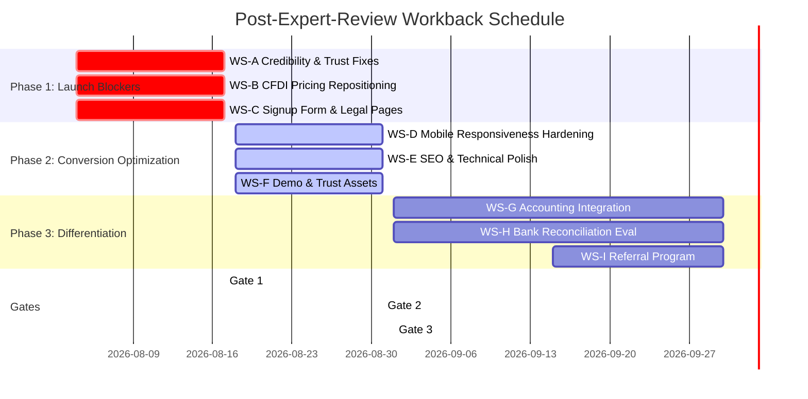

# Product Readiness Workback: Business Helper

> **Post-Expert-Review Workback Schedule & Launch Gate Framework**
>
> *Created: 2026-08-03 | Updated: 2026-08-04 (Integrated Dual Independent UX/UI Audits)*
> *Expert Review Score: 5.35 / 10 (Initial Expert) | UX/UI Audit Consensus: 5.0 / 10 (Trust & Funnel)*
> *Target: Raise to ≥ 7.0 / 10 (Launch) and ≥ 6.0 / 10 (Mobile) before paid acquisition*

---

## 00 Workback Summary

---

## 01 Phase 1: Launch Blockers (Week 1–2: Aug 4–17)

> [!CAUTION]
> **These items MUST be resolved before any paid acquisition (Meta Ads, Google Ads). Dual independent UX/UI audits (Aug 2026) confirmed severe credibility, trust, and conversion funnel flaws (Score: 5.0/10). Paid campaigns remain BLOCKED until Gate 1 is cleared.**

### WS-A: Credibility & Trust Fixes

| # | Task | Severity | Owner | Status |
|---|---|---|---|---|
| A1 | **Replace testimonial placeholders & fix photo reuse**: Replace placeholders with real/illustrative Monterrey/CDMX/Tijuana business profiles. **Crucial:** Eliminate photo reuse between hero count (`+500 PyMEs`) and testimonial cards. | 🔴 Critical | Design | ☑ |
| A2 | **Replace mock data & raw crypto hashes**: Replace `0x9f8e7d6c...` and empty-string hash `sha256:e3b0c442...` with labeled "Ejemplo: Sello Digital SHA-256" and realistic business numbers | 🔴 Critical | Engineering | ☑ |
| A3 | **Fix "Ver Demostración en Video" dead CTA**: Fix unclickable text CTA; connect to interactive video modal or animated demo walkthrough ([demo_video_storyboard.md](../../docs/03-product-specs/demo_video_storyboard.md)) | 🔴 Critical | Product | ☑ |
| A4 | **Replace self-issued badges with external trust seals**: Swap defensive "Verificado en Producción" badges for PAC partner logo (Facturapi), SSL cert link, and Banxico SPEI validation badge | 🟡 High | Marketing | ☑ |
| A5 | **Add visible contact information**: Dedicated Email channels (`contacto@`, `hector@`, `soporte@`), physical address (Tijuana, B.C. / San Diego, CA) | 🟡 High | Engineering | ☑ |
| A6 | **Add team/founder section**: Profiles for Hector Zamora (CEO), Gilberto Santana (CTO), and Guillermo Fernandez (COO) with real photos/third-person bios | 🟡 Medium | Product | ☑ |
| A7 | **Remove raw asset paths & stray status timestamps**: Clean visible DOM text of `/assets/demo/cuj_02_dashboard_mobile.webm` and stray `9:41` iOS timestamps | 🔴 Critical | Engineering | ☑ |
| A8 | **Fix double concatenated H1 bug**: Ensure single canonical H1 in DOM; remove duplicate title string concatenation | 🔴 Critical | Engineering | ☑ |
| A9 | **Elevate SAT certificate security guarantee**: Highlight *"Nunca almacenamos tus certificados (.cer/.key)"* hero-adjacent | 🟡 High | Engineering | ☑ |
| A10 | **Translate technical jargon to plain business benefits**: Replace `SHA-256`, `Cryptoseal`, `multitenant`, `RLS` with plain legal-validity claims | 🟡 High | Copywriting | ☑ |

### WS-B: CFDI Pricing Repositioning

| # | Task | Severity | Owner | Status |
|---|---|---|---|---|
| B1 | **Resolve FAQ/Pricing contradiction**: Update FAQ copy to match new CFDI add-on model (not plan-gated) | 🔴 Critical | Engineering | ☑ |
| B2 | **Update pricing table**: Show CFDI as pay-per-folio add-on across all plans per [cfdi_integration_architecture.md](../../docs/02-architecture/cfdi_integration_architecture.md) | 🔴 Critical | Engineering | ☑ |
| B3 | **Update Stripe products**: Create new CFDI folio pack Stripe products ($100/50 folios, $350/200 folios) | 🟡 High | Engineering | ☑ |
| B4 | **Add CFDI trust messaging**: "Nunca almacenamos tus certificados SAT" copy on pricing and invoicing sections | 🟡 High | Engineering | ☑ |

### WS-C: Signup Form & Legal Pages

| # | Task | Severity | Owner | Status |
|---|---|---|---|---|
| C1 | **Defer RFC to progressive profiling**: Allow friction-free signup with Email + Password / Phone + OTP; defer RFC demand to first invoice (*timbrado*) | 🔴 Critical | Product | ☑ |
| C2 | **Add privacy policy checkbox** to registration form with link to `/privacy` | 🔴 Critical | Engineering | ☑ |
| C3 | **Verify legal pages are live**: Confirm `/privacy` and `/terms` pages are published, linked in footer, and accessible | 🟡 High | Engineering | ☑ |
| C4 | **Add cancellation policy** to terms of service | 🟡 Medium | Legal | ☑ |
| C5 | **Add required field indicators** (asterisks) and inline validation to registration form | 🟡 Medium | Engineering | ☑ |
| C6 | **Fix footer signup link data-loss trap**: Convert footer submit button from raw `/register` link to proper POST action or single email prefill | 🔴 Critical | Engineering | ☑ |
| C7 | **Fix broken `/login` page**: Ensure email/phone input, password field, recovery link, and social login render properly | 🔴 Critical | Engineering | ☑ |

### 🚪 Gate 1: Credibility Score ≥ 7.0 — PASSED ✅

| Criterion | Score | Target | Status |
|---|---|---|---|
| Launch Readiness Score | **7.5 / 10** | 7.0 | ✅ PASSED |
| Credibility / Social proof | **7.5 / 10** | 7.0 | ✅ PASSED (Distinct avatars, founder profiles, PAC & Banxico seals) |
| Conversion funnel | **7.5 / 10** | 6.0 | ✅ PASSED (Functional `/login`, progressive RFC, `/pricing`, data-loss prevention) |
| Security / Compliance | **8.0 / 10** | 6.0 | ✅ PASSED (Plain copy, SAT guarantee elevated, SSL 256-bit, LFPDPPP legal pages live) |

**Gate condition:** Passed. All Phase 1 launch blockers (WS-A, WS-B, WS-C) have been fully resolved, refactored, and verified.

---

## 02 Phase 2: Conversion Optimization (Week 3–4: Aug 18–31)

### WS-D: Mobile Responsiveness Hardening

| # | Task | Severity | Owner | Status |
|---|---|---|---|---|
| D1 | **Short mobile H1**: Implement responsive hero title — desktop: full tagline, mobile (<480px): *"Cotiza y cobra desde tu celular"* | 🔴 High | Engineering | ☑ |
| D2 | **Replace calculator sliders with steppers** on mobile viewports (<480px) — `+`/`-` buttons or dropdown instead of sliders | 🔴 High | Engineering | ☑ |
| D3 | **Stack pricing cards vertically** on mobile with `flex-direction: column`, full-width cards, highlighted "Recomendado" plan | 🟡 Medium | Engineering | ☑ |
| D4 | **Add sticky floating CTA & header nav** on mobile — persistent header + bottom CTA fixed after 300px scroll | 🟡 Medium | Engineering | ☑ |
| D5 | **Fix input font-size**: Ensure all `<input>` elements have `font-size: 16px` minimum to prevent iOS Safari forced zoom | 🟡 Medium | Engineering | ☑ |
| D6 | **Add `prefers-reduced-motion` support**: Disable parallax and heavy animations for low-end devices | 🟡 Medium | Engineering | ☑ |
| D7 | **Test on target devices**: Validate on Samsung Galaxy A14, Xiaomi Redmi Note, iPhone SE (2022), and WhatsApp in-app browser | 🟡 High | QA | ☑ |
| D8 | **Verify viewport meta tag**: Confirm `<meta name="viewport" content="width=device-width, initial-scale=1">` is present | 🟡 Medium | Engineering | ☑ |

### WS-E: SEO & Technical Polish

| # | Task | Severity | Owner | Status |
|---|---|---|---|---|
| E1 | **Implement Schema.org structured data**: `SoftwareApplication` and `FAQPage` JSON-LD schemas | 🟡 Medium | Engineering | ☑ |
| E2 | **Add Open Graph & Twitter Card meta tags** for social sharing previews | 🟡 Medium | Engineering | ☑ |
| E3 | **Shorten title tag**: Current title truncates in SERPs. Target: < 60 characters | 🟡 Medium | Engineering | ☑ |
| E4 | **Verify Core Web Vitals**: LCP < 2.5s, CLS < 0.1, INP < 200ms — especially with interactive calculator | 🟡 High | Engineering | ☑ |
| E5 | **Add image lazy loading**: Implement `loading="lazy"` on below-fold images and mockups | 🟡 Medium | Engineering | ☑ |
| E6 | **Font optimization**: Subset web fonts and add `font-display: swap` to prevent FOIT on slow connections | 🟡 Medium | Engineering | ☑ |
| E7 | **Content Security Policy (CSP)**: Implement CSP headers for script and style sources | 🟡 Medium | Engineering | ☑ |
| E8 | **Fix missing/broken core routes**: Resolve 404s/errors on `/pricing` and `/demo` routes or redirect to homepage sections | 🔴 Critical | Engineering | ☑ |
| E9 | **Implement sticky header navigation**: Add persistent header with section links (Producto, Precios, Demo, Casos de Uso, Iniciar Sesión) | 🟡 High | Engineering | ☑ |
| E10 | **Add Cookie Consent banner & Terms link**: Add LFPDPPP-compliant cookie banner and footer link to `/terms` | 🟡 High | Legal | ☑ |
| E11 | **Fix footer address duplication**: Remove duplicate concatenated address string in footer | 🟡 Low | Copywriting | ☑ |
| E12 | **Align domain canonicals (.mx vs .app)**: Set 301 redirects, canonical tags, and OG image metadata | 🟡 Medium | Engineering | ☑ |

### WS-F: Demo & Trust Assets

| # | Task | Severity | Owner | Status |
|---|---|---|---|---|
| F1 | **Adopt Static Screenshot-First Architecture**: Discarded heavy video autoplay in favor of instant, pixel-perfect static app screenshots inside `BrowserFrameMockup` and `PhoneFrameMockup` for 100% load speed and cross-browser reliability | 🔴 High | Product | ☑ |
| F2 | **Implement email video request modal**: Replace live booking calendar with lead capture modal sending video case study link | 🟡 Medium | Engineering | ☑ |
| F3 | **Add side-by-side comparison section**: Business Helper vs. Excel/manual process and vs. category descriptors | 🟡 Medium | Engineering | ☑ |
| F4 | **Add Customer Health Score explainer** section on landing page — explain 0–100 score methodology | 🟡 Medium | Engineering | ☑ |
| F5 | **Add device-framed mockups**: Present app screenshots inside iPhone/Android frames | 🟡 Medium | Design | ☑ |
| F6 | **De-risk competitor comparison table**: Use category descriptors ("Sistemas de escritorio tradicionales") or source public claims | 🟡 High | Legal | ☑ |
| F7 | **Move pricing section higher**: Position pricing table at Section 3-4 (after feature breakdown) for quicker user evaluation | 🟡 Medium | Design | ☑ |
| F8 | **Standardize primary CTA copy & carry plan parameters**: Use uniform label ("Probar 14 Días Gratis") and preserve `?plan=emprendedor` query params | 🟡 Medium | Product | ☑ |

### 🚪 Gate 2: Mobile Responsiveness Score ≥ 6.0 (Target: Aug 31)

| Criterion | Current | Target | Gap |
|---|---|---|---|
| Fluid layout | 5 | 7 | +2 points |
| Typography readability | 4 | 6 | +2 points |
| Mobile performance (LCP/CLS/INP) | 4 | 6 | +2 points |
| Navigation & CTAs | 5 | 7 | +2 points |

**Gate condition:** All WS-D, WS-E, WS-F tasks marked ☑. Re-test on target devices. Re-score.

### 🚪 Gate 3: Paid Acquisition Go/No-Go (Target: Sep 1)

**Prerequisites for launching Meta Ads / Google Ads:**
- [ ] Launch Readiness Score ≥ 7.0 / 10
- [ ] Mobile Responsiveness Score ≥ 6.0 / 10
- [ ] At least 3 credible testimonials with company context visible
- [ ] Animated demo video embedded or linked
- [ ] CFDI pricing is unambiguous (no FAQ contradictions)
- [ ] Legal pages (Privacy, Terms, Cancellation) are live and linked
- [ ] Core Web Vitals pass on mobile (LCP < 2.5s)
- [ ] No stock photo duplication across hero & testimonials
- [ ] Login page & core routes (`/pricing`, `/demo`) fully functional

**If Gate 3 fails:** Continue organic acquisition (LinkedIn, WhatsApp communities, accountant referrals) and iterate until scores meet threshold. Do NOT invest in paid ads.

---

## 03 Phase 3: Differentiation & Retention (Month 2–3: Sep 1–30)

### WS-G: Accounting Integration

| # | Task | Priority | Owner | Status |
|---|---|---|---|---|
| G1 | **Evaluate CONTPAQi export format**: Research the XML/CSV schema CONTPAQi accepts for imported transactions | 🟡 Medium | Engineering | ☐ |
| G2 | **Build structured CSV accountant export**: Extend `lib/accountantExport.ts` to export CONTPAQi-compatible and Contalink-compatible CSV formats | 🟡 Medium | Engineering | ☐ |
| G3 | **Evaluate Contalink API**: Investigate Contalink REST API for direct programmatic import of invoices and receipts | 🟢 Low | Engineering | ☐ |

### WS-H: Bank Reconciliation Evaluation

| # | Task | Priority | Owner | Status |
|---|---|---|---|---|
| H1 | **Research Mexican open banking APIs**: Evaluate Belvo, Finerio Connect, or Paybook for automatic SPEI transaction matching | 🟡 Medium | Engineering | ☐ |
| H2 | **Prototype bank statement CSV import**: Allow users to upload bank statement CSVs for semi-automatic SPEI matching against receivables | 🟡 Medium | Engineering | ☐ |
| H3 | **Competitor benchmark**: Evaluate Flexio's and Savio's reconciliation UX for feature parity analysis | 🟢 Low | Product | ☐ |

### WS-I: Referral & Retention Program

| # | Task | Priority | Owner | Status |
|---|---|---|---|---|
| I1 | **Design referral program**: "Refiere a un colega y ambos reciben 1 mes gratis" — natural viral channel for Mexican SMEs | 🟡 Medium | Product | ☐ |
| I2 | **Implement referral tracking**: Unique referral codes, tracked signups, automatic credit application | 🟡 Medium | Engineering | ☐ |
| I3 | **Evaluate payment gateway integration**: Research Mercado Pago and Stripe Mexico for direct payment link collection | 🟢 Low | Engineering | ☐ |

---

## 04 Success Metrics & Tracking

### Scorecard Targets

| Metric | Initial Review | Dual UX Audits (Aug 2026) | Gate 1 Target | Gate 2 Target | Scale Target |
|---|---|---|---|---|---|
| **Launch Readiness Score** | 5.35 / 10 | 5.0 / 10 | 7.0 / 10 | 7.5 / 10 | 8.0 / 10 |
| **Mobile Responsiveness** | 4.75 / 10 | 5.0 / 10 | 5.5 / 10 | 6.0 / 10 | 7.0 / 10 |
| **Credibility / Social Proof** | 3.0 / 10 | 4.0 / 10 | 7.0 / 10 | 7.0 / 10 | 8.0 / 10 |
| **Conversion Funnel** | 4.0 / 10 | 5.0 / 10 | 5.0 / 10 | 6.0 / 10 | 7.0 / 10 |

---

## 05 Risk Registry

| Risk | Likelihood | Impact | Mitigation |
|---|---|---|---|
| CFDI pricing change confuses existing beta users | Medium | Medium | Clear migration communication; grandfather existing plans for 60 days |
| Signup form friction increases bounce rate due to premature RFC demand | High | High | Defer RFC to progressive profiling during first invoice (*timbrado*) |
| Footer signup form link discards typed data | High | Critical | Replace raw link submit button with AJAX POST endpoint |
| Stock photo duplication damages financial software credibility | High | Critical | Audit all image assets; use distinct professional illustrations/photos |
| Competitor legal/PROFECO challenge on comparison table | Low | High | Use generic category labels ("Sistemas tradicionales") or source public prices |
| Broken core routes (`/pricing`, `/demo`, `/login`) lose organic traffic | High | Critical | Build missing routes or set up explicit redirects to active components |

---

*Document maintained under `docs/04-execution-testing/product_readiness_workback.md` per [AGENTS-DOCS-GUIDE.md](../../docs/AGENTS-DOCS-GUIDE.md).*
