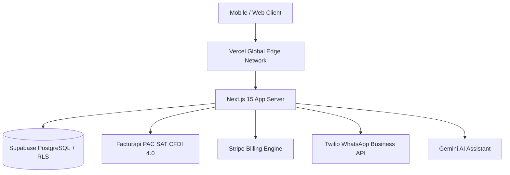

# Production Deployment & Go-to-Market Guide: Business Helper

> **Comprehensive Step-by-Step Guide for Cloud Deployment (Vercel / Supabase)**

---

## 01 Deployment Architecture Overview



---

## 02 Step 1: Database Migration Setup (Supabase)

1. Log into [Supabase Dashboard](https://database.new) and create a new project.
2. Under **Project Settings -> Database**, obtain the connection string and database password.
3. **⚠️ CRITICAL: If this is the first deployment (includes security hardening), run the migration first:**
   ```bash
   export SUPABASE_DB_URL="postgres://postgres:[PASSWORD]@[HOST]:5432/postgres"

   npm run db:migrate:dry   # list what would be applied
   npm run db:migrate       # apply
   ```
   The `20260806120000_security_hardening.sql` migration **must run before deploying code** to close P0 RLS vulnerabilities. See `docs/security-p0-remediation.md` for details.

4. Apply all PostgreSQL migrations in `supabase/migrations/`:
   ```bash
   npm run db:migrate:dry   # list what would be applied
   npm run db:migrate       # apply
   ```

   > **Ordering matters.** Migrations are applied by hand; Vercel auto-deploys
   > `main` on merge and never touches the database. Merging a schema change
   > without running this first ships code against the old schema — new columns
   > missing, and any policy the migration drops still live.
   >
   > For a release that carries a migration:
   > 1. Set any new environment variables (inert until the code lands).
   > 2. `npm run db:migrate`.
   > 3. Merge.
   >
   > CI flags any pull request touching `supabase/migrations/` as a reminder.
4. Verify all 9 multi-tenant RLS tables are active:
   - `organizations`
   - `organization_members`
   - `clients`
   - `quotes`
   - `quote_items`
   - `contracts`
   - `milestones`
   - `products`
   - `activity_logs`
5. Create public storage bucket `spei-vouchers` with `< 5MB` file size restriction and image/PDF MIME type policy.

---

## 03 Step 2: Vercel Cloud Deployment

1. Import repository `business-helper` on [Vercel Console](https://vercel.com/new).
2. Configure Project Settings:
   - **Framework Preset**: Next.js
   - **Root Directory**: `./`
   - **Build Command**: `npm run build`
   - **Output Directory**: `.next`
3. Add Environment Variables (from [.env.production](file:///Users/jhzamora/.gemini/antigravity-ide/scratch/business-helper/.env.production) template):
   - **Core Infrastructure**:
     - `NEXT_PUBLIC_SUPABASE_URL`: `https://dfyoavffxzujvxvnsizi.supabase.co`
     - `NEXT_PUBLIC_SUPABASE_ANON_KEY`: `sb_publishable_4w3ZlvFUwFtRTWI5s6QfVw_127miFZO`
     - `SUPABASE_SERVICE_ROLE_KEY`: `<your-supabase-service-role-secret-key>` (required for public endpoints & webhooks)
     - `NODE_ENV`: `production`
     - `NEXT_PUBLIC_APP_URL`: `https://business-helper.vercel.app`
   - **Security & Billing (Required)**:
     - `OTP_SECRET`: ≥32 random chars (e.g., `openssl rand -hex 32`). Keys OTP digests and e-signature seals. **Critical — do not rotate in production without invalidating outstanding OTP codes.**
     - `STRIPE_SECRET_KEY`: Live Stripe Secret Key (`sk_live_...`)
     - `STRIPE_WEBHOOK_SECRET`: Live Stripe Webhook Signing Secret (`whsec_...`) from Stripe Dashboard
     - `STRIPE_PRICE_INICIAL`: Exact Stripe Price ID for Inicial tier
     - `STRIPE_PRICE_NEGOCIO`: Exact Stripe Price ID for Negocio tier
     - `STRIPE_PRICE_EMPRESA`: Exact Stripe Price ID for Empresa tier
   - **Third-Party Integrations (Optional)**:
     - `FACTURAPI_SECRET_KEY` (Live PAC key `sk_live_...` & SAT CSD `.cer`/`.key` upload)
     - `TWILIO_ACCOUNT_SID`, `TWILIO_AUTH_TOKEN`, `TWILIO_WHATSAPP_NUMBER` (for OTP delivery via WhatsApp)
     - `META_WHATSAPP_TOKEN`, `META_PHONE_NUMBER_ID` (alternative: Meta WhatsApp Cloud API for OTP delivery)
     - `GEMINI_API_KEY` (Google Cloud Gemini API Key)
4. Click **Deploy**.

---

## 04 Step 3: Webhook Integrations

### Stripe Webhook Setup
- In Stripe Dashboard, navigate to **Developers -> Webhooks**.
- Add Endpoint: `https://businesshelper.mx/api/stripe/webhook`.
- Select events:
  - `customer.subscription.created`
  - `customer.subscription.updated`
  - `customer.subscription.deleted`
- Copy Signing Secret into Vercel `STRIPE_WEBHOOK_SECRET`.

---

## 05 Step 4: Post-Deployment Smoke Test & Verification

Run health check verification against the live domain:
```bash
curl -i https://businesshelper.mx/api/health
```
Expected HTTP 200 payload:
```json
{
  "status": "healthy",
  "timestamp": "2026-07-31T19:20:00.000Z",
  "services": {
    "database": "connected",
    "auth": "active"
  }
}
```

---

## 05b Step 4b: Security Verification (P0 Hardening)

If this deployment includes the security hardening migration (`20260806120000_security_hardening.sql`), verify the fixes are active:

**Required verification steps:**
- [ ] With the Supabase anon key, `select * from quotes` from a browser console returns zero rows (previously: every tenant's quotes)
- [ ] `POST /api/quotes/public/<token>` with `{"otpCode":"111111","serverOtp":"111111"}` returns 400, not a signature
- [ ] A code issued via `POST /api/quotes/public/<token>/otp` signs successfully; the same code replayed a second time does not
- [ ] A code fails after 3 wrong attempts or 5 minutes
- [ ] `curl -X POST https://yourapi.com/api/stripe/webhook -d '{"unsignedEvent":true}'` returns 400 (rejects unsigned requests)
- [ ] Two organizations with different CLABEs each see their own on the payment page
- [ ] An organization with no CLABE configured gets 409, not a fallback account

**See:** `docs/security-p0-remediation.md` §5 for the complete staging checklist.

---

## 06 Step 5: Custom Domain Provisioning Protocol

When ready to transition from `.vercel.app` to a production custom domain (e.g., `businesshelper.mx`):

1. **Vercel Custom Domain Configuration**:
   - Go to Vercel Console -> **Project Settings -> Domains**.
   - Add domain `businesshelper.mx` (and `www.businesshelper.mx`).
   - Configure DNS Records with your domain registrar:
     - **Apex Domain (`businesshelper.mx`)**: A Record pointing to `76.76.21.21`
     - **Subdomain (`www`)**: CNAME Record pointing to `cname.vercel-dns.com`

2. **Environment Variable & Redirect URL Sync**:
   - Update `NEXT_PUBLIC_APP_URL=https://businesshelper.mx` in Vercel.
   - Go to [Supabase Auth URL Configuration](https://supabase.com/dashboard/project/dfyoavffxzujvxvnsizi/auth/url-configuration):
     - Update **Site URL**: `https://businesshelper.mx`
     - Update **Redirect URLs**: `https://businesshelper.mx/auth/callback`

3. **Webhook Endpoint Sync**:
   - In Stripe Dashboard (**Developers -> Webhooks**), update the endpoint URL to `https://businesshelper.mx/api/stripe/webhook`.

---

## 07 Step 6: Dedicated White-Labeling & Branding Sprint Roadmap

To provide enterprise-grade branding for Mexican SMBs and multi-tenant portal users, the upcoming **Branding Sprint** scopes the following features:

1. **Tenant Brand Asset Management**:
   - Create private storage bucket `org-logos` in Supabase Storage with `< 2MB` restriction for SVG/PNG transparent logos.
   - Add Organization Settings panel under `/dashboard/settings/branding` allowing business owners to upload logos and select primary/secondary brand hex colors.

2. **Dynamic UI & Portal Customization**:
   - Apply dynamic CSS variables (`--primary-color`, `--header-bg`, `--accent-color`) generated by `lib/branding.ts` across public quote viewer (`/q/[token]`), digital signature portal (`/sign/[token]`), and SPEI payment upload page (`/pay/[token]`).
   - Embed custom tenant logo and header banner on client-facing PDF quote and contract downloads.

3. **White-Labeled Client Communication**:
   - Custom WhatsApp message templates featuring tenant company name (`org.name`) and brand taglines in automated payment reminders.
   - Custom transactional email headers powered by Resend / Supabase Auth templates matching the tenant's brand color scheme.

4. **Enterprise Custom CNAME Routing (Future Tier)**:
   - Allow Plan Empresa subscribers to map custom CNAME records (e.g. `cotizaciones.minegocio.com`) directly to public quote endpoints via Vercel Edge Middleware or Cloudflare for SaaS.
