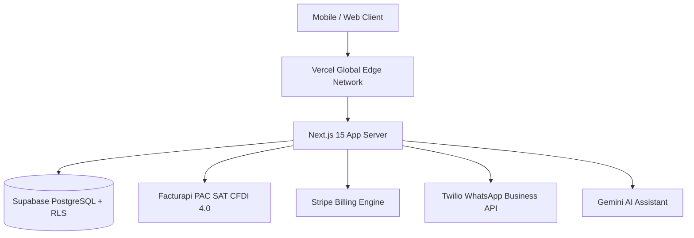

# Production Deployment & Go-to-Market Guide: Business Helper

<!-- STATUS-AUTHORITY: docs/STATUS.md -->

> [!NOTE]
> **Live status lives in [`docs/STATUS.md`](STATUS.md) — not here.** The checkboxes here are **deployment steps to perform**, not a record that they were performed.

> **Comprehensive Step-by-Step Guide for Cloud Deployment (Vercel / Supabase)**

---

## 01 Deployment Architecture Overview



---

## 02 Step 1: Database Migration Setup (Supabase)

1. Log into [Supabase Dashboard](https://database.new) and create a new project.
2. Under **Project Settings -> Database**, obtain the connection string and database password.
3. **⚠️ CRITICAL: If this is the first deployment (includes security hardening), run the migration first:**
   ```bash
   export SUPABASE_DB_URL="postgres://postgres:[PASSWORD]@[HOST]:5432/postgres"

   npm run db:migrate:dry   # list what would be applied
   npm run db:migrate       # apply
   ```
   The `20260806120000_security_hardening.sql` migration **must run before deploying code** to close P0 RLS vulnerabilities. See `docs/security-p0-remediation.md` for details.

4. Apply all PostgreSQL migrations in `supabase/migrations/`:
   ```bash
   npm run db:migrate:dry   # list what would be applied
   npm run db:migrate       # apply
   ```

   > **Ordering matters.** Migrations are applied by hand; Vercel auto-deploys
   > `main` on merge and never touches the database. Merging a schema change
   > without running this first ships code against the old schema — new columns
   > missing, and any policy the migration drops still live.
   >
   > For a release that carries a migration:
   > 1. Set any new environment variables (inert until the code lands).
   > 2. `npm run db:migrate`.
   > 3. Merge.
   >
   > CI flags any pull request touching `supabase/migrations/` as a reminder.
4. Verify all 9 multi-tenant RLS tables are active:
   - `organizations`
   - `organization_members`
   - `clients`
   - `quotes`
   - `quote_items`
   - `contracts`
   - `milestones`
   - `products`
   - `activity_logs`
5. Create public storage bucket `spei-vouchers` with `< 5MB` file size restriction and image/PDF MIME type policy.

---

## 03 Step 2: Vercel Cloud Deployment

1. Import repository `business-helper` on [Vercel Console](https://vercel.com/new).
2. Configure Project Settings:
   - **Framework Preset**: Next.js
   - **Root Directory**: `./`
   - **Build Command**: `npm run build`
   - **Output Directory**: `.next`
3. Add Environment Variables (see `.env.example` for the full list; never commit a populated `.env.production`):
   - **Core Infrastructure**:
     - `NEXT_PUBLIC_SUPABASE_URL`: `https://dfyoavffxzujvxvnsizi.supabase.co`
     - `NEXT_PUBLIC_SUPABASE_ANON_KEY`: `sb_publishable_4w3ZlvFUwFtRTWI5s6QfVw_127miFZO`
     - `SUPABASE_SERVICE_ROLE_KEY`: `<your-supabase-service-role-secret-key>` (required for public endpoints & webhooks)
     - `NODE_ENV`: `production`
     - `NEXT_PUBLIC_APP_URL`: `https://business-helper.vercel.app`
   - **Security & Billing (Required)**:
     - `OTP_SECRET`: ≥32 random chars (e.g., `openssl rand -hex 32`). Keys OTP digests and e-signature seals. **Critical — do not rotate in production without invalidating outstanding OTP codes.**
     - `STRIPE_SECRET_KEY`: Live Stripe Secret Key (`sk_live_...`)
     - `STRIPE_WEBHOOK_SECRET`: Live Stripe Webhook Signing Secret (`whsec_...`) from Stripe Dashboard
     - `STRIPE_PRICE_INICIAL`: Exact Stripe Price ID for Inicial tier
     - `STRIPE_PRICE_NEGOCIO`: Exact Stripe Price ID for Negocio tier
     - `STRIPE_PRICE_EMPRESA`: Exact Stripe Price ID for Empresa tier
     - **Verify before charging anyone**: `npm run verify:stripe` with the same variables exported locally. It reads the account and every price back from Stripe and fails if the account cannot take charges, a price id does not exist in that mode, or a tier bills an amount the pricing page does not advertise. Every request it makes is a GET, so it is safe against the live account. A tier with no Price ID cannot be sold at all — checkout answers `503 STRIPE_PRICE_NOT_CONFIGURED`.
   - **OTP Delivery (Required for e-signature)**:
     - `OTP_DELIVERY_CHANNEL`: `email` (launch channel), or the deprecated `sms` / `whatsapp`. Unset fails closed in production — the signing flow returns 502.
     - For `email`: `RESEND_API_KEY`, `OTP_EMAIL_FROM` (the from-domain must be verified in Resend — DNS records on `businesshelper.app`). The code goes to `clients.email`; a client without one gets a 422 naming the missing field.
     - For `sms` (deprecated): `TWILIO_ACCOUNT_SID`, `TWILIO_AUTH_TOKEN`, `TWILIO_SMS_NUMBER`
     - For `whatsapp` (deprecated) via Twilio: `TWILIO_ACCOUNT_SID`, `TWILIO_AUTH_TOKEN`, `TWILIO_WHATSAPP_NUMBER`; via Meta: `META_WHATSAPP_TOKEN`, `META_PHONE_NUMBER_ID`
     - **Verify before trusting the channel**: `npm run verify:otp` with the same variables exported locally. It names any variable the selected provider is missing and authenticates against Resend/Twilio/Meta without sending. Add `OTP_TEST_EMAIL=you@…` (or `OTP_TEST_PHONE=+52…` on the deprecated channels) to send one sample message to an inbox or handset you control. Half-configured credentials return the same 502 as no configuration at all, so the first person to notice would otherwise be a signer.
     - Clients need `clients.phone` populated; the issue endpoint answers 422 without it.
   - **CFDI 4.0 Invoicing**:
     - `PAC_ENCRYPTION_KEY`: 32 bytes (base64 or hex) sealing the PAC API keys tenants connect. Required before anyone can connect a PAC; without it `/api/organization/pac` answers 503 rather than storing a credential in plaintext.
     - `FACTURAPI_SECRET_KEY` (optional): the platform's own PAC key (`sk_live_...`), used by tenants who have not connected one. Their stamps consume the folios their plan includes. A `sk_test_` key is refused in production — it produces documents with no fiscal validity.
     - Business Helper never receives CSD certificates (`.cer`/`.key`): they stay with the user's PAC.
     - Storage: the `cfdi-documents` bucket is created by `supabase/migrations/20260807120000_cfdi_pac_integration.sql` and must stay private.
   - **Third-Party Integrations (Optional)**:
     - `GEMINI_API_KEY` (Google Cloud Gemini API Key)
4. Click **Deploy**.

---

## 04 Step 3: Webhook Integrations

### Stripe Webhook Setup
- In Stripe Dashboard, navigate to **Developers -> Webhooks**.
- Add Endpoint: `https://businesshelper.app/api/stripe/webhook`.
- Select events:
  - `customer.subscription.created`
  - `customer.subscription.updated`
  - `customer.subscription.deleted`
- Copy Signing Secret into Vercel `STRIPE_WEBHOOK_SECRET`.

### Google Sign-In (`Continuar con Google`)

<!-- STATUS-AUTHORITY: docs/STATUS.md -->

This is a **Supabase dashboard action, not a code change** — the app side (the
`/auth/callback` route handler, the landing logic, the funnel event) already ships. Whether the
button appears at all is decided at runtime by asking the Auth server, so nothing here needs a
deploy: enabling the provider makes the button reappear on the next page load, and disabling it
makes it vanish again.

1. **Google Cloud Console** → *APIs & Services* → *Credentials* → create an **OAuth 2.0 Client ID**
   (type: *Web application*). Authorized redirect URI:
   `https://<project-ref>.supabase.co/auth/v1/callback` — the *Supabase* callback, not the app's.
2. **Supabase Dashboard** → *Authentication* → *Providers* → **Google**: enable it and paste the
   client ID and secret.
3. **Supabase Dashboard** → *Authentication* → *URL Configuration* → **Redirect URLs**: add
   `https://businesshelper.app/auth/callback`. `redirectTo` is built from
   `window.location.origin`, so every additional origin you want Google sign-in on — each Vercel
   preview host included — needs its own entry or the consent screen rejects the request.

**Confirm it took**, without opening a browser — this is the same read the app makes:

```bash
curl -s "https://<project-ref>.supabase.co/auth/v1/settings?apikey=<anon-key>" | jq .external.google
```

`true` means the Auth server will accept the provider. While it is `false`, the app hides the
button rather than offering a control that dead-ends: `signInWithOAuth` navigates the browser
before it can report anything, so a disabled provider used to land the user on GoTrue's raw
English JSON error (`"Unsupported provider: provider is not enabled"`) on a `supabase.co`
origin, with no way back. See `lib/authProviders.ts`.

A `true` here still is not a working sign-in — only one real Google sign-up on the deployed site
proves the redirect allow-list and the client credentials are right. That round-trip is what
[#48](https://github.com/jesushzv/business-helper/issues/48) is waiting on.

---

## 05 Step 4: Post-Deployment Smoke Test & Verification

Run health check verification against the live domain:
```bash
curl -i https://businesshelper.app/api/health
```
Expected HTTP 200 payload:
```json
{
  "status": "healthy",
  "timestamp": "2026-07-31T19:20:00.000Z",
  "services": {
    "database": "connected",
    "auth": "active"
  }
}
```

---

## 05b Step 4b: Security Verification (P0 Hardening)

If this deployment includes the security hardening migration (`20260806120000_security_hardening.sql`), verify the fixes are active:

**Webhook checks are scripted** — run against staging, never production:
```bash
WEBHOOK_URL=https://staging.example.com/api/stripe/webhook \
STRIPE_WEBHOOK_SECRET=whsec_… \
ORG_ID=<a real organization uuid in that deployment's database> \
npm run verify:webhook
```

All three variables are required for a complete run. `ORG_ID` is not optional
convenience: the two checks that need it — a signed subscription event is
applied, and its redelivery is not applied twice — are the two that protect
money, and they write to that organization, so use a staging target you are
willing to change. Without it the script runs the signature checks, prints
`INCOMPLETE`, and **exits non-zero**; there is no flag to turn that into a pass.

> [!WARNING]
> **The target allowlist guards the URL, not the database behind it.** The
> script refuses any host that is not localhost, a `*.vercel.app` preview, or
> `staging.*`. A Vercel preview is a preview of the *code*: its environment
> variables come from the same project, and Vercel applies a variable to Preview
> as well as Production unless it was scoped otherwise. A preview of this repo
> can therefore hold the production `SUPABASE_SERVICE_ROLE_KEY`, and the two
> `ORG_ID` checks would write `subscription_tier` and `subscription_status` to a
> real tenant. Check which Supabase project the target's variables point at
> before setting `ORG_ID`. The six signature checks write nothing and are safe
> against any allowlisted target.

What a green run proves, and what it does not:

| Proved | Not proved |
|:---|:---|
| The endpoint's `STRIPE_WEBHOOK_SECRET` matches the one you signed with, and valid signatures are accepted | That Stripe itself can reach the endpoint — that is the Dashboard's "Send test webhook", separate from this |
| Unsigned, wrong-secret, tampered, stale and future-dated requests are all rejected | That live-mode events carry the metadata the route reads (`metadata.organization_id`) — set at Checkout, so it depends on §05c |
| A signed subscription event is applied to a real row, and a redelivery of it is not applied twice | Anything about the tier the user actually bought — see the price-to-tier mapping in §05c |

The first check is a positive control on purpose. Before it existed, a
deployment with **no** `STRIPE_WEBHOOK_SECRET` set passed every rejection check,
because it rejected everything, and the script reported a pass. The endpoint now
answers `503` rather than `400` when it has no secret to check against, so
"unconfigured" and "rejected your forgery" are distinguishable — in this script
and in Stripe's own delivery log.

The script prints a record block on a successful run (target, org, revision,
timestamp). Paste it into [`STATUS.md`](STATUS.md), which is where a claim about
what has been verified belongs.

**Remaining checks by hand:**
- [ ] With the Supabase anon key, `select * from quotes` from a browser console returns zero rows (previously: every tenant's quotes)
- [ ] `POST /api/quotes/public/<token>` with `{"otpCode":"111111","serverOtp":"111111"}` returns 400, not a signature
- [ ] A code issued via `POST /api/quotes/public/<token>/otp` arrives on the configured channel and signs successfully; the same code replayed a second time does not
- [ ] A code fails after 3 wrong attempts or 5 minutes
- [ ] Two organizations with different CLABEs each see their own on the payment page
- [ ] An organization with no CLABE configured gets 409, not a fallback account

**See:** `docs/security-p0-remediation.md` §5 for the complete staging checklist.

---

## 05c Step 4c: Live Billing, Team Invitations & Accountant Export

These three features returned fabricated success until the remediation of issue
#4 (`Simulated features presented as real`). They now depend on real
configuration, and each fails loudly rather than pretending:

**Migration required.** `20260806160000_team_invitations.sql` creates
`organization_invitations`. Without it, `POST /api/organization/members`
returns a 500 instead of writing an invitation — apply migrations before
deploying the code, per §03.

**Stripe must be configured for checkout to work at all.** `/api/stripe/checkout`
calls the Stripe API and returns the hosted session URL Stripe issues. With no
`STRIPE_SECRET_KEY` it answers `503 STRIPE_NOT_CONFIGURED`; there is no longer a
placeholder URL for the "upgrade" button to open. Required variables:

| Variable | Purpose |
|---|---|
| `STRIPE_SECRET_KEY` | Creates the Checkout Session (`sk_test_…` or `sk_live_…`) |
| `STRIPE_WEBHOOK_SECRET` | Verifies the event that actually grants the tier |
| `STRIPE_PRICE_INICIAL` / `STRIPE_PRICE_NEGOCIO` / `STRIPE_PRICE_EMPRESA` | Price ids the session bills against |

The subscription tier is written **only** by the signature-verified webhook. The
settings screen no longer sets it locally, so a deployment with a secret key but
no webhook secret will take payments without upgrading the account.

**Each price id is required, and there is no default.** These variables used to
fall back to invented ids (`price_negocio_599_mxn`), so an unmapped tier posted
a price no Stripe account has and failed with the same message a Stripe outage
produces. An unset tier now answers `503 STRIPE_PRICE_NOT_CONFIGURED` and logs
the variable to set. In the other direction, a price id pointed at the wrong
tier charges the wrong amount and looks successful everywhere — run the
preflight before a card is involved:

```bash
STRIPE_SECRET_KEY=sk_live_… \
STRIPE_PRICE_INICIAL=price_… STRIPE_PRICE_NEGOCIO=price_… STRIPE_PRICE_EMPRESA=price_… \
NEXT_PUBLIC_APP_URL=https://businesshelper.app \
npm run verify:stripe
```

It checks, against the real account: the key is accepted, `charges_enabled` and
`payouts_enabled` are true, every tier's price exists and is active, is in MXN
at the amount the pricing page advertises, recurs monthly, is in the same
live/test mode as the key, no two tiers share a price id, and a webhook endpoint
is registered for `NEXT_PUBLIC_APP_URL` subscribing to the four events the route
handles. It is read-only — unlike `verify:webhook` below, it is safe against
production. The webhook **signing secret** cannot be read back from the Stripe
API, so `npm run verify:webhook` is still what proves that half.

A passing run does not mean money has moved. Live mode is done when a real card
has been charged end to end, the subscription appears on the organization, and
the webhook that recorded it passed signature verification.

**Checklist:**
- [ ] Selecting a plan in `/settings` opens a `checkout.stripe.com` session and, after a test card, the tier changes via the webhook — not before
- [ ] Inviting a colleague returns an `/invitacion/<token>` link; opening it while signed in as the invited address joins the organization, and a second use is refused
- [ ] An invitation link opened by a different account is rejected (`EMAIL_MISMATCH`)
- [ ] `/api/accountant/export?month=YYYY-MM` returns the tenant's own milestones; a month with no records exports an empty CSV rather than sample rows

---

## 05d Step 4d: OTP Send Rate Limiting

`POST /api/quotes/public/[token]/otp` is unauthenticated by design — the signer
is not logged in and the quote token is the whole credential. Until the
remediation of issue #17 its only bound was a 30s cooldown on
`quotes.client_otp_sent_at`, which is per quote: a client with several open
quotes has several valid tokens resolving to one client contact, so cycling
between them issued a code on every request. On the deprecated sms/whatsapp
channels every send is a billable Twilio/Meta message — on SMS the pattern
carriers flag as pumping; on email an unmetered loop is how a sending domain
lands on a blocklist.

**Migrations required.** `20260807000000_otp_send_rate_limit.sql` creates
`otp_send_log`, the persisted counter the limit reads,
`20260809120000_otp_send_delivery_failed.sql` adds the flag that lets a
provider failure release its lifetime slot (#60), and
`20260811120000_otp_email_recipient.sql` widens the ledger's recipient CHECK so
the email channel's keys (lowercased addresses) are accepted alongside E.164
phones — without it every email-channel send fails closed. Counters have to be
persisted: Vercel functions share no memory, so an in-process counter would
reset on a cold start and limit nothing. **Without the table the endpoint
returns 500 rather than sending unmetered codes** — apply migrations before
deploying the code, per §03.

Current limits (`lib/otpRateLimit.ts`, revised for #22/#60):

| Bound | Value | Keyed on |
|---|---|---|
| Resend backoff | 30s doubling per send this hour (30s → 60s → 120s → …), capped at 15 min | The recipient (email or phone) |
| Hourly window | 5 codes per rolling hour | The recipient, across every quote |
| Daily window | 15 codes per rolling 24h | The recipient, across every quote |
| Lifetime cap | 10 **delivered** codes | One quote |

The backoff replaced the flat 30-second per-quote cooldown: same first step,
but the gap widens with each send, so a batch signer barely notices while a
drip hits a widening wall. A delivery failure keeps its hourly and daily slots
(a broken provider stays throttled) but releases the lifetime one, so an
outage cannot make a quote permanently unsignable. The daily figure is
convention (Twilio suggests 10–20/day), not a standard — revisit against real
traffic once a provider is live.

Over-cap requests answer `429` in the shape the cooldown already used —
`{ "error": …, "retry_after_seconds": N }` — with `retry_after_seconds` omitted
on the lifetime cap, where waiting does not help.

**Checklist:**
- [ ] Two quotes belonging to the same client share one budget: alternating between their tokens stops at the hourly cap instead of sending on every request
- [ ] The cap holds across separate serverless invocations (verify from the deployed URL, not `next dev`)
- [ ] A different client's contact still receives codes while the first is capped
- [ ] Rows appear in `otp_send_log` with `phone_e164` holding the normalized recipient (lowercased email on the email channel; E.164 on the deprecated ones), and the table returns nothing to the anon key

---

## 06 Step 5: Custom Domain Provisioning Protocol

When ready to transition from `.vercel.app` to a production custom domain (e.g., `businesshelper.app`):

1. **Vercel Custom Domain Configuration**:
   - Go to Vercel Console -> **Project Settings -> Domains**.
   - Add domain `businesshelper.app` (and `www.businesshelper.app`).
   - Configure DNS Records with your domain registrar:
     - **Apex Domain (`businesshelper.app`)**: A Record pointing to `76.76.21.21`
     - **Subdomain (`www`)**: CNAME Record pointing to `cname.vercel-dns.com`

2. **Environment Variable & Redirect URL Sync**:
   - Update `NEXT_PUBLIC_APP_URL=https://businesshelper.app` in Vercel.
   - Go to [Supabase Auth URL Configuration](https://supabase.com/dashboard/project/dfyoavffxzujvxvnsizi/auth/url-configuration):
     - Update **Site URL**: `https://businesshelper.app`
     - Update **Redirect URLs**: `https://businesshelper.app/auth/callback`

3. **Webhook Endpoint Sync**:
   - In Stripe Dashboard (**Developers -> Webhooks**), update the endpoint URL to `https://businesshelper.app/api/stripe/webhook`.

---

## 07 Step 6: Dedicated White-Labeling & Branding Sprint Roadmap

To provide enterprise-grade branding for Mexican SMBs and multi-tenant portal users, the upcoming **Branding Sprint** scopes the following features:

1. **Tenant Brand Asset Management**:
   - Create private storage bucket `org-logos` in Supabase Storage with `< 2MB` restriction for SVG/PNG transparent logos.
   - Add Organization Settings panel under `/dashboard/settings/branding` allowing business owners to upload logos and select primary/secondary brand hex colors.

2. **Dynamic UI & Portal Customization**:
   - Apply dynamic CSS variables (`--primary-color`, `--header-bg`, `--accent-color`) generated by `lib/branding.ts` across public quote viewer (`/q/[token]`), digital signature portal (`/sign/[token]`), and SPEI payment upload page (`/pay/[token]`).
   - Embed custom tenant logo and header banner on client-facing PDF quote and contract downloads.

3. **White-Labeled Client Communication**:
   - Custom WhatsApp message templates featuring tenant company name (`org.name`) and brand taglines in automated payment reminders.
   - Custom transactional email headers powered by Resend / Supabase Auth templates matching the tenant's brand color scheme.

4. **Enterprise Custom CNAME Routing (Future Tier)**:
   - Allow Plan Empresa subscribers to map custom CNAME records (e.g. `cotizaciones.minegocio.com`) directly to public quote endpoints via Vercel Edge Middleware or Cloudflare for SaaS.
