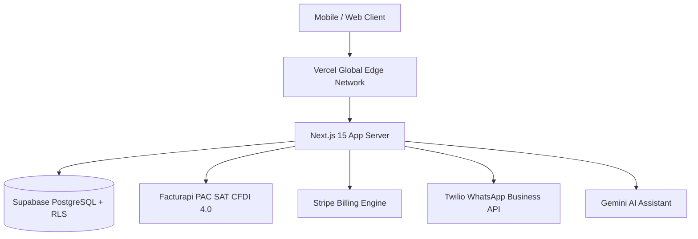

# Production Deployment & Go-to-Market Guide: Business Helper

> **Comprehensive Step-by-Step Guide for Cloud Deployment (Vercel / Supabase)**

---

## 01 Deployment Architecture Overview



---

## 02 Step 1: Database Migration Setup (Supabase)

1. Log into [Supabase Dashboard](https://database.new) and create a new project.
2. Under **Project Settings -> Database**, obtain the connection string and database password.
3. Apply standard PostgreSQL migrations in `supabase/migrations/`:
   ```bash
   npx supabase db push --db-url "postgres://postgres:[PASSWORD]@[HOST]:5432/postgres"
   ```
4. Verify all 9 multi-tenant RLS tables are active:
   - `organizations`
   - `organization_members`
   - `clients`
   - `quotes`
   - `quote_items`
   - `contracts`
   - `milestones`
   - `products`
   - `activity_logs`
5. Create public storage bucket `spei-vouchers` with `< 5MB` file size restriction and image/PDF MIME type policy.

---

## 03 Step 2: Vercel Cloud Deployment

1. Import repository `business-helper` on [Vercel Console](https://vercel.com/new).
2. Configure Project Settings:
   - **Framework Preset**: Next.js
   - **Root Directory**: `./`
   - **Build Command**: `npm run build`
   - **Output Directory**: `.next`
3. Add Environment Variables (from `.env.example` template):
   - `NEXT_PUBLIC_SUPABASE_URL`
   - `NEXT_PUBLIC_SUPABASE_ANON_KEY`
   - `SUPABASE_SERVICE_ROLE_KEY`
   - `FACTURAPI_SECRET_KEY`
   - `STRIPE_SECRET_KEY`
   - `STRIPE_WEBHOOK_SECRET`
   - `TWILIO_ACCOUNT_SID`
   - `TWILIO_AUTH_TOKEN`
   - `TWILIO_PHONE_NUMBER`
   - `GEMINI_API_KEY`
   - `NEXT_PUBLIC_APP_URL`
4. Click **Deploy**.

---

## 04 Step 3: Webhook Integrations

### Stripe Webhook Setup
- In Stripe Dashboard, navigate to **Developers -> Webhooks**.
- Add Endpoint: `https://businesshelper.mx/api/stripe/webhook`.
- Select events:
  - `customer.subscription.created`
  - `customer.subscription.updated`
  - `customer.subscription.deleted`
- Copy Signing Secret into Vercel `STRIPE_WEBHOOK_SECRET`.

---

## 05 Step 4: Post-Deployment Smoke Test & Verification

Run health check verification against the live domain:
```bash
curl -i https://businesshelper.mx/api/health
```
Expected HTTP 200 payload:
```json
{
  "status": "healthy",
  "timestamp": "2026-07-31T19:20:00.000Z",
  "services": {
    "database": "connected",
    "auth": "active"
  }
}
```
