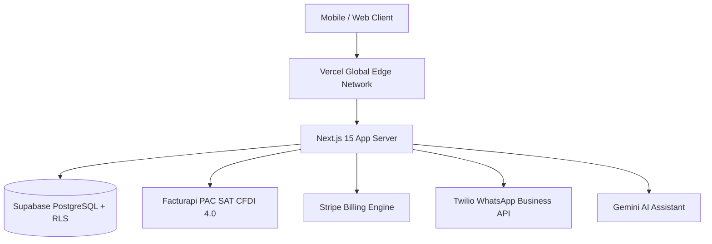

# Production Deployment & Go-to-Market Guide: Business Helper

> **Comprehensive Step-by-Step Guide for Cloud Deployment (Vercel / Supabase)**

---

## 01 Deployment Architecture Overview



---

## 02 Step 1: Database Migration Setup (Supabase)

1. Log into [Supabase Dashboard](https://database.new) and create a new project.
2. Under **Project Settings -> Database**, obtain the connection string and database password.
3. Apply standard PostgreSQL migrations in `supabase/migrations/`:
   ```bash
   npx supabase db push --db-url "postgres://postgres:[PASSWORD]@[HOST]:5432/postgres"
   ```
4. Verify all 9 multi-tenant RLS tables are active:
   - `organizations`
   - `organization_members`
   - `clients`
   - `quotes`
   - `quote_items`
   - `contracts`
   - `milestones`
   - `products`
   - `activity_logs`
5. Create public storage bucket `spei-vouchers` with `< 5MB` file size restriction and image/PDF MIME type policy.

---

## 03 Step 2: Vercel Cloud Deployment

1. Import repository `business-helper` on [Vercel Console](https://vercel.com/new).
2. Configure Project Settings:
   - **Framework Preset**: Next.js
   - **Root Directory**: `./`
   - **Build Command**: `npm run build`
   - **Output Directory**: `.next`
3. Add Environment Variables (from [.env.production](file:///Users/jhzamora/.gemini/antigravity-ide/scratch/business-helper/.env.production) template):
   - **Active Production Keys (Configured)**:
     - `NEXT_PUBLIC_SUPABASE_URL`: `https://dfyoavffxzujvxvnsizi.supabase.co`
     - `NEXT_PUBLIC_SUPABASE_ANON_KEY`: `sb_publishable_4w3ZlvFUwFtRTWI5s6QfVw_127miFZO`
     - `SUPABASE_SERVICE_ROLE_KEY`: `<your-supabase-service-role-secret-key>`
     - `NODE_ENV`: `production`
     - `NEXT_PUBLIC_APP_URL`: `https://business-helper.vercel.app`
   - **Pending Third-Party Production Keys (To be added post-launch)**:
     - `FACTURAPI_SECRET_KEY` (Live PAC key `sk_live_...` & SAT CSD `.cer`/`.key` upload)
     - `STRIPE_SECRET_KEY` & `STRIPE_WEBHOOK_SECRET` (Live Stripe key & signing secret)
     - `STRIPE_PRICE_EMPRENDEDOR`, `STRIPE_PRICE_NEGOCIO`, `STRIPE_PRICE_EMPRESA` (Live Price IDs)
     - `TWILIO_ACCOUNT_SID`, `TWILIO_AUTH_TOKEN`, `TWILIO_PHONE_NUMBER` (Live WhatsApp Business API)
     - `GEMINI_API_KEY` (Google Cloud Gemini API Key)
4. Click **Deploy**.

---

## 04 Step 3: Webhook Integrations

### Stripe Webhook Setup
- In Stripe Dashboard, navigate to **Developers -> Webhooks**.
- Add Endpoint: `https://businesshelper.mx/api/stripe/webhook`.
- Select events:
  - `customer.subscription.created`
  - `customer.subscription.updated`
  - `customer.subscription.deleted`
- Copy Signing Secret into Vercel `STRIPE_WEBHOOK_SECRET`.

---

## 05 Step 4: Post-Deployment Smoke Test & Verification

Run health check verification against the live domain:
```bash
curl -i https://businesshelper.mx/api/health
```
Expected HTTP 200 payload:
```json
{
  "status": "healthy",
  "timestamp": "2026-07-31T19:20:00.000Z",
  "services": {
    "database": "connected",
    "auth": "active"
  }
}
```

---

## 06 Step 5: Custom Domain Provisioning Protocol

When ready to transition from `.vercel.app` to a production custom domain (e.g., `businesshelper.mx`):

1. **Vercel Custom Domain Configuration**:
   - Go to Vercel Console -> **Project Settings -> Domains**.
   - Add domain `businesshelper.mx` (and `www.businesshelper.mx`).
   - Configure DNS Records with your domain registrar:
     - **Apex Domain (`businesshelper.mx`)**: A Record pointing to `76.76.21.21`
     - **Subdomain (`www`)**: CNAME Record pointing to `cname.vercel-dns.com`

2. **Environment Variable & Redirect URL Sync**:
   - Update `NEXT_PUBLIC_APP_URL=https://businesshelper.mx` in Vercel.
   - Go to [Supabase Auth URL Configuration](https://supabase.com/dashboard/project/dfyoavffxzujvxvnsizi/auth/url-configuration):
     - Update **Site URL**: `https://businesshelper.mx`
     - Update **Redirect URLs**: `https://businesshelper.mx/auth/callback`

3. **Webhook Endpoint Sync**:
   - In Stripe Dashboard (**Developers -> Webhooks**), update the endpoint URL to `https://businesshelper.mx/api/stripe/webhook`.

---

## 07 Step 6: Dedicated White-Labeling & Branding Sprint Roadmap

To provide enterprise-grade branding for Mexican SMBs and multi-tenant portal users, the upcoming **Branding Sprint** scopes the following features:

1. **Tenant Brand Asset Management**:
   - Create private storage bucket `org-logos` in Supabase Storage with `< 2MB` restriction for SVG/PNG transparent logos.
   - Add Organization Settings panel under `/dashboard/settings/branding` allowing business owners to upload logos and select primary/secondary brand hex colors.

2. **Dynamic UI & Portal Customization**:
   - Apply dynamic CSS variables (`--primary-color`, `--header-bg`, `--accent-color`) generated by `lib/branding.ts` across public quote viewer (`/q/[token]`), digital signature portal (`/sign/[token]`), and SPEI payment upload page (`/pay/[token]`).
   - Embed custom tenant logo and header banner on client-facing PDF quote and contract downloads.

3. **White-Labeled Client Communication**:
   - Custom WhatsApp message templates featuring tenant company name (`org.name`) and brand taglines in automated payment reminders.
   - Custom transactional email headers powered by Resend / Supabase Auth templates matching the tenant's brand color scheme.

4. **Enterprise Custom CNAME Routing (Future Tier)**:
   - Allow Plan Empresa subscribers to map custom CNAME records (e.g. `cotizaciones.minegocio.com`) directly to public quote endpoints via Vercel Edge Middleware or Cloudflare for SaaS.
